# Тема 2. Базовые операции языка Python

Отчёт по Теме #2 выполнил:

- Беков Дмитрий Александрович
- АИС-23-1

| Задание   | Лаб_раб | Сам_раб |
| ------    | ------ | ------ |
| Задание 1 | + | + |
| Задание 2 | + | + |
| Задание 3 | + | + |
| Задание 4 | + | + |
| Задание 5 | + | + |
| Задание 6 | + | + |
| Задание 7 | + | + |
| Задание 8 | + | + |
| Задание 9 | + | + |
| Задание 10 | + | + |

Работу проверили:
- к.э.н., доцент Панов М.А.

## Лабораторная работа №1
### Выведите в консоль три строки. Первая – любое число. Вторая – любое число в виде строки. Третья – любое число с плавающей точкой.

```python
print(123)
print('123')
print(1.23)
```

### Результат
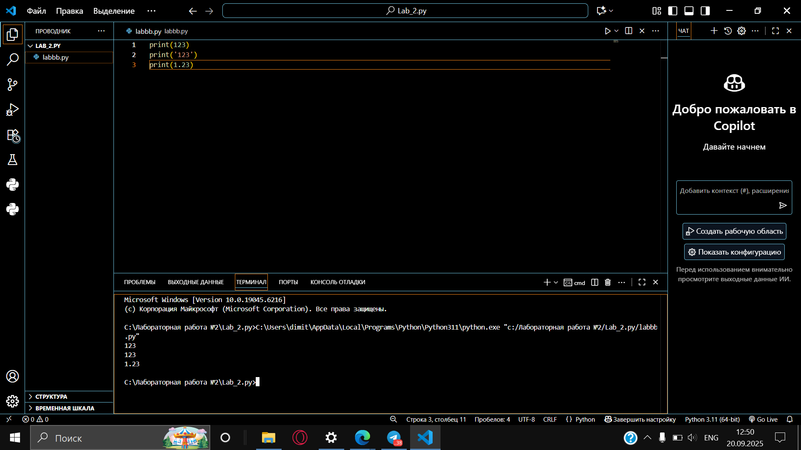

## Выводы
В данном коде выводятся три строки с использованием функции `print()`. Каждая строка содержит разные значения:

1. `print(123)`: Выводится целое число 123. Это число не взаимодействует со строковыми операциями и выводится как есть.

2. `print('123')`: Выводится строка '123', так как она заключена в одинарные кавычки. В этом случае это текстовая строка, а не число.

3. `print(1.23)`: Выводится число с плавающей точкой 1.23. Так же, как и в первом случае, оно выводится как числовое значение.

## Лабораторная работа №2
### Выведите в консоль три строки. Первая - результат сложения или вычитания минимум двух переменных типа int. Вторая – результат сложения или вычитания минимум двух переменных типа float. Третья – результат сложения или вычитания минимум двух переменных типа int и float.

```python
print(1823 - 486)
print(5.1 + 8.27)
print(3 + 7.04 + 1 + 2.33)
```

### Результат
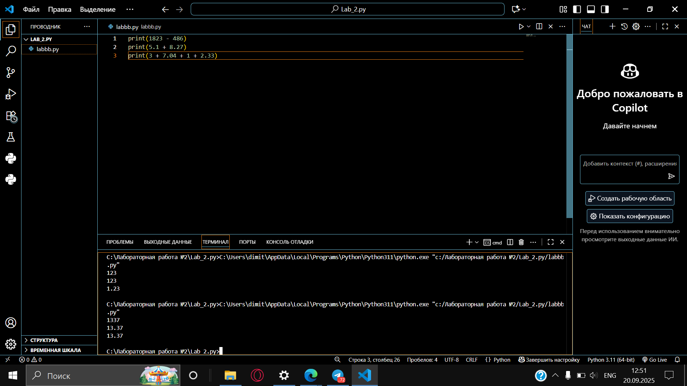


## Лабораторная работа №3
### Выведите в консоль три строки. Первая – обычная строка. Вторая – F строка с использованием заранее объявленной переменной. Третья – сложите две или более строк в одну

```python
ordinary_string = "Первая строка"
name = "Python"
f_string = f"Привет, {name}!"
combined_string = "Строка 1" + " + " + "Строка 2"
```

### Результат
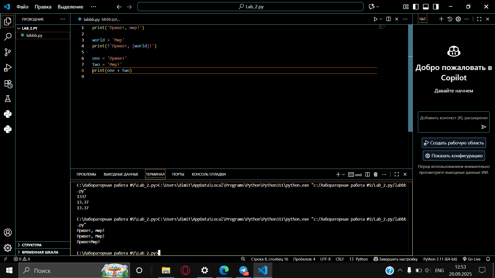


## Лабораторная работа №4
### Выведите в консоль три строки. Первая – трансформация любого типа переменной в bool. Вторая - трансформация любого типа переменной float или int. Третья - трансформация любого типа переменной в str.

```python
one = 'Hello'
print(bool(one))

two = 142
print(float(two))

three = None
print(str(three))
```

### Результат
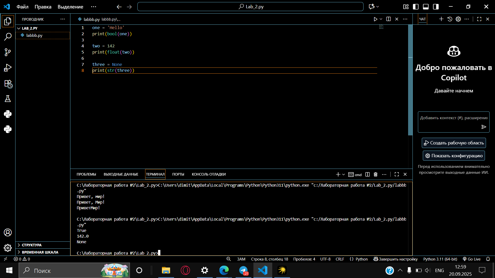


## Лабораторная работа №5
### Присвойте трем переменным различные значения, воспользовавшись функцией input()

```python
one = input('one:')
two = input('two:')
three = input('three:')
```

### Результат
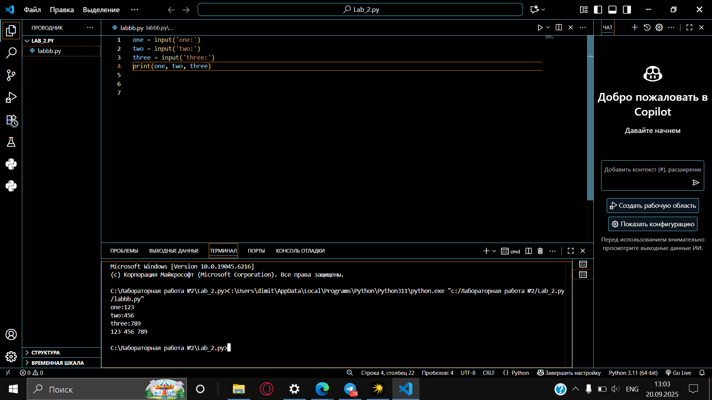


## Лабораторная работа №6
### Создайте две любые числовые переменные и выполните над ними несколько математических операций: возведение в степень, обычное деление, целочисленное деление, нахождение остатка от деления. При желании вы можете проверить как работают эти вычисления с разными типами данных, например, сначала создать две переменные int, затем создать две переменные float и наконец создать переменные типа int и float и провести над ними операции, прописанные выше.

```python
a = 12
b = 5
print('Возведение в степень:', a**b)
print('обычное деление:', a / b)
print('Целочисленное деление:', a // b)
print('Нахождение остатка от деления:', a % b)
```

### Результат
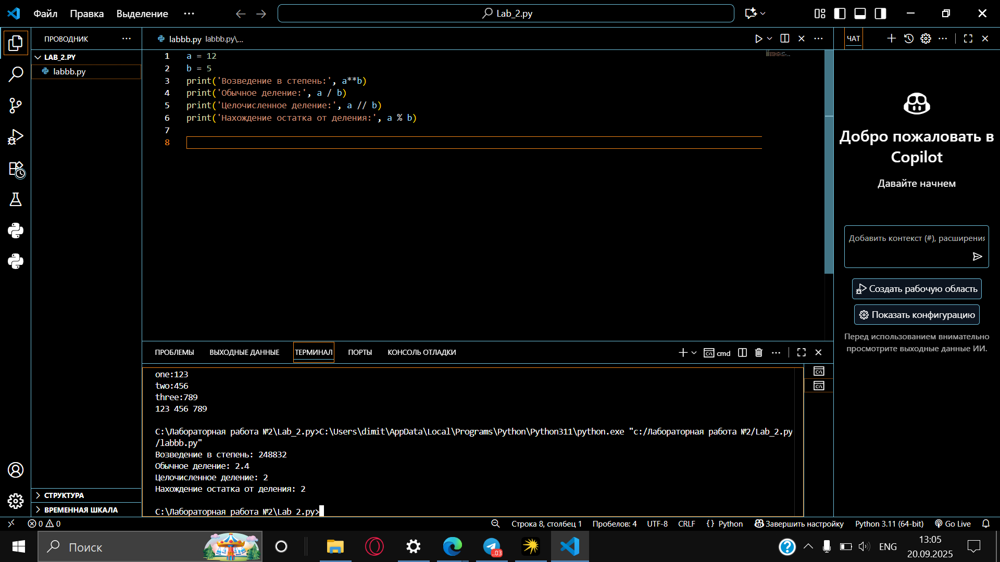


## Лабораторная работа №7
### Создайте любую строковую переменную и производите над ней математическое действие умножение на любое число.

```python
line = 'Hello!'
print(line * 6)
```

### Результат
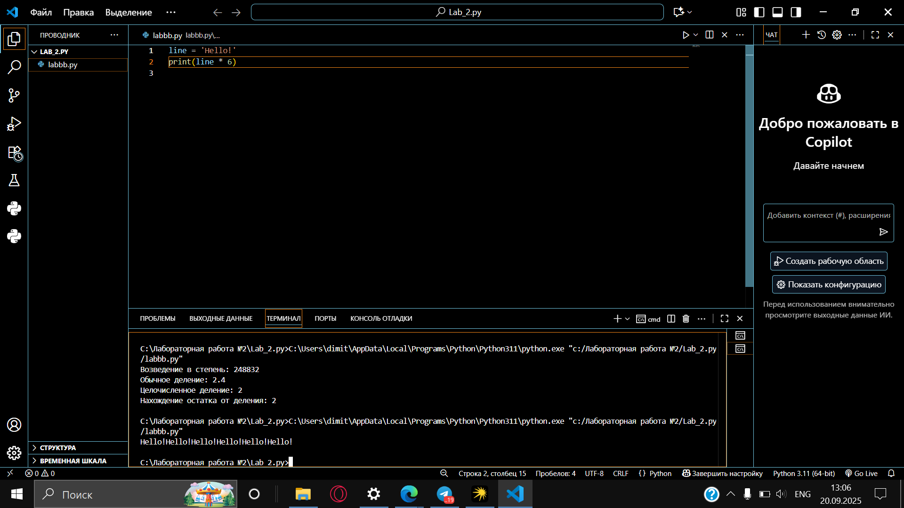


## Лабораторная работа №8
### Посчитайте сколько раз символ 'o' встречается в строке 'Hello World'.

```python
sentence = 'Hello World'
print(sentence.count('o'))
```

### Результат
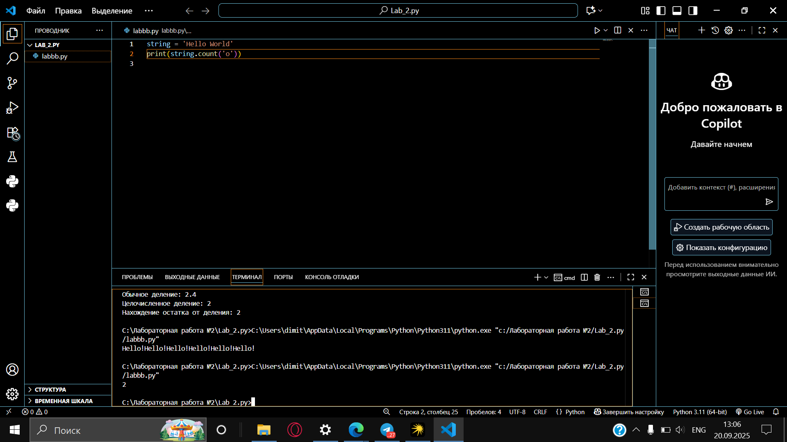


## Лабораторная работа №9
### Напишите предложение 'Hello World' в две строки. Написанная программа должна занимать одну строку в редакторе кода.

```python
print('Hello\nWorld')
```

### Результат
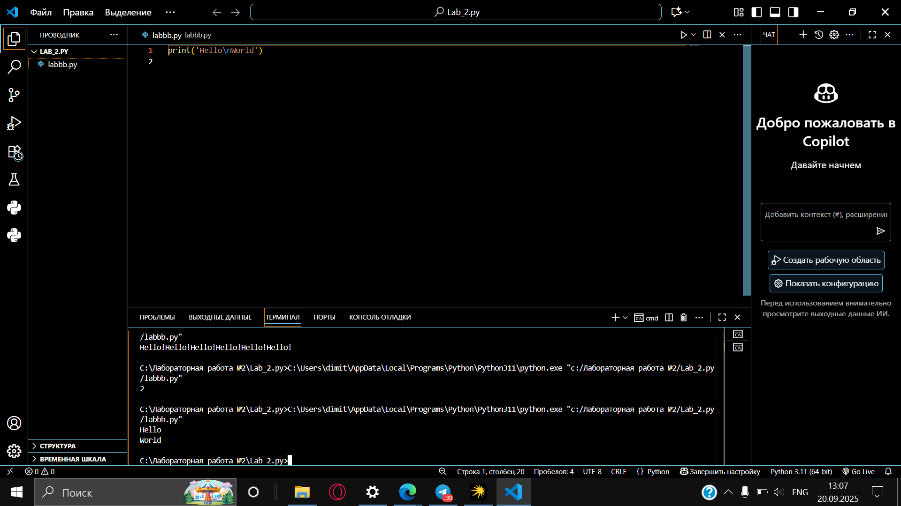

## Лабораторная работа №10
### Из предложения 'Hello World' выведите в консоль только 2 символ, а затем выведите слово 'Hello'

```python
sentence = 'Hello World'
print(sentence[1])
print(sentence[:5])
```

### Результат
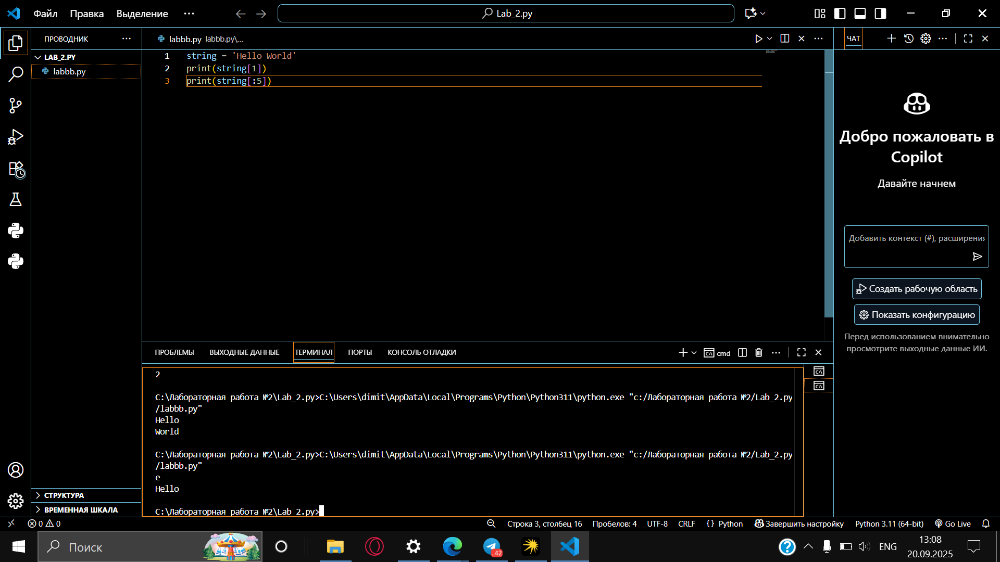

## Самостоятельная работа №1
### Выведите в консоль булеву переменную False, не используя слово False в строке или изначально присвоенную булеву переменную. Программа должна занимать не более двух строк редактора кода.

```python
print(5 > 10)
```
## Результат
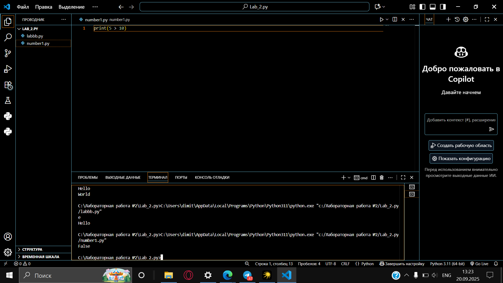

## Выводы
В данном коде используется оператор сравнения >, который возвращает булево значение False, так как 5 не больше 10. Таким образом, мы выводим False без непосредственного использования этого слова.

## Самостоятельная работа №2
### Присвойте значения трех переменных и выведите их в консоль, используя только две строки редактора кода.

```python
a, b, c = 1, 2, 3; print(a, b, c)
```
## Результат
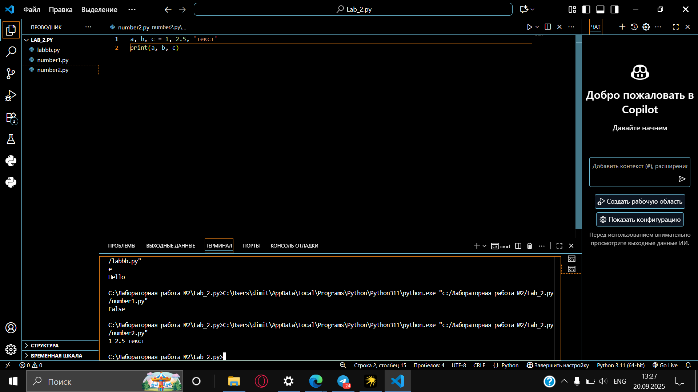

## Выводы
Код использует множественное присваивание для одновременного определения трех переменных и их вывода в одной строке. Точка с запятой позволяет разделить два выражения в одной строке кода.

## Самостоятельная работа №3
### Реализуйте ввод данных в программу, через консоль, в виде только целых чисел (тип данных int). То есть при вводе буквенных символов в консоль, программа не должна работать. Программа должна занимать не более двух строк редактора кода.

```python
num = int(input())
print(num)
```
## Результат


## Выводы
Функция ```int()``` преобразует ввод пользователя в целое число. При вводе нечисловых символов возникнет исключение ValueError, что соответствует требованию "программа не должна работать" с некорректным вводом.

## Самостоятельная работа №4
### Создайте только одну строковую переменную. Линия строки должна не превышать 5 символов. На выходе мы должны получить строку длиной не менее 16 символов. Программа должна занимать не более двух строк редактора кода.

```python
s = "Hi!" 
print(s * 6)
```

## Результат


## Выводы 
Строка "Hi!" содержит 3 символа (удовлетворяет условию ≤5). Умножение строки на 6 создает новую строку "Hi!Hi!Hi!Hi!Hi!Hi!" длиной 18 символов, что удовлетворяет условию ≥16.

## Самостоятельная работа №5
### Создайте три переменные: день (тип данных - числовой), месяц (тип данных - строка), год (тип данных - числовой) и выведите в консоль текущую дату в формате: "Сегодня день месяц год. Всего хорошего" используя F строку и оператор под внутри print(), в котором мы должны написать фразу "Всего хорошего". Программа должна занимать не более двух строк редактора кода.

```python
day, month, year = 15, "мая", 2023 
print(f"Сегодня {day} {month} {year}. {'Всего хорошего'}")
```

## Результат


## Выводы
Код использует f-строку для форматированного вывода и включает строку 'Всего хорошего' непосредственно в выражение вывода, что позволяет уложиться в две строки кода.

## Самостоятельная работа №6
### В предложении 'Hello World' вставьте 'my' между двумя словами. Выведите полученное предложение в консоль в одну строку. Программа должна занимать не более двух строк редактора кода.

```python
s = "Hello World" 
print(s.replace(" ", " my "))
```

## Результат
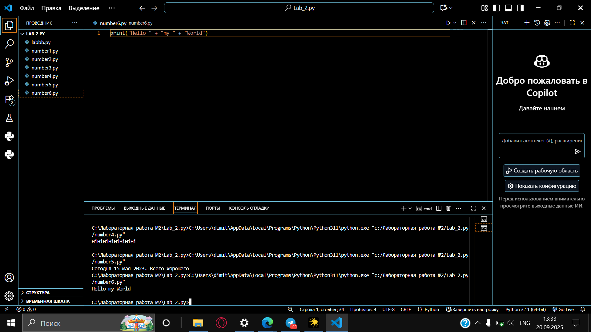

## Выводы
Метод ```replace()``` заменяет пробел между словами на " my ", эффективно вставляя нужное слово между "Hello" и "World".

## Самостоятельная работа №7
### Узнайте длину предложения 'Hello World', результат выведите в консоль. Программа должна занимать не более двух строк редактора кода.

```python
s = "Hello World" 
print(len(s))
```
## Результат
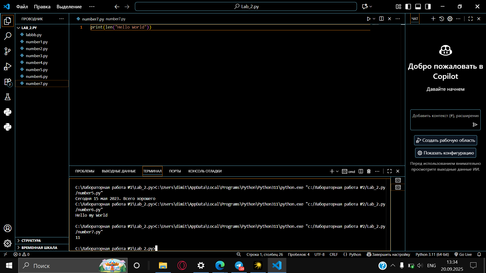

## Выводы
Функция ```len()``` возвращает длину строки, включая пробел. Для строки "Hello World" результат будет 11 символов.

## Самостоятельная работа №8
### Переведите предложение 'HELLO WORLD' в нижний регистр. Программа должна занимать не более двух строк редактора кода.

```python
s = "HELLO WORLD" 
print(s.lower())
```

## Результат
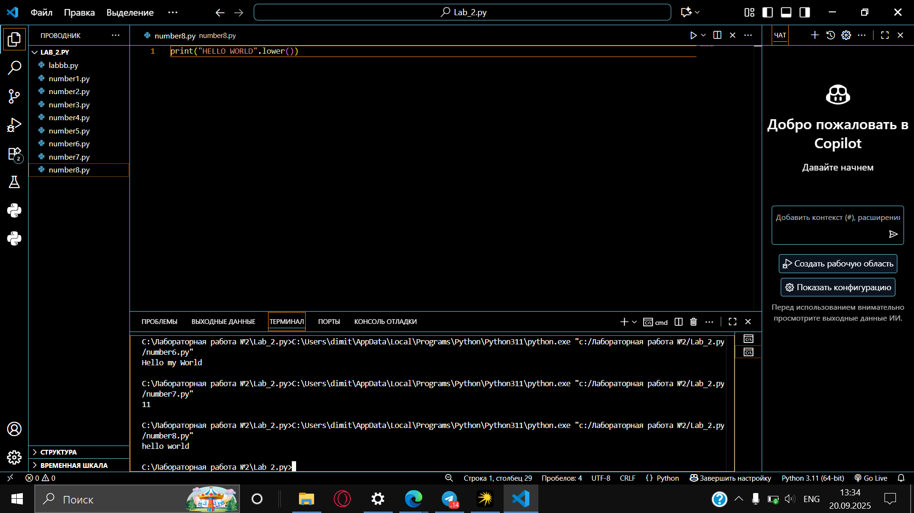

## Выводы
Метод ```lower()``` преобразует все символы строки в нижний регистр, результатом будет "hello world".

## Самостоятельная работа №9
### Самостоятельно придумайте задачу по проходимой теме и решите ее. Задача должна быть связана со взаимодействием с числовыми значениями.

```python
a, b = 5, 10 
print(f"Площадь прямоугольника: {a * b}")
```

## Результат
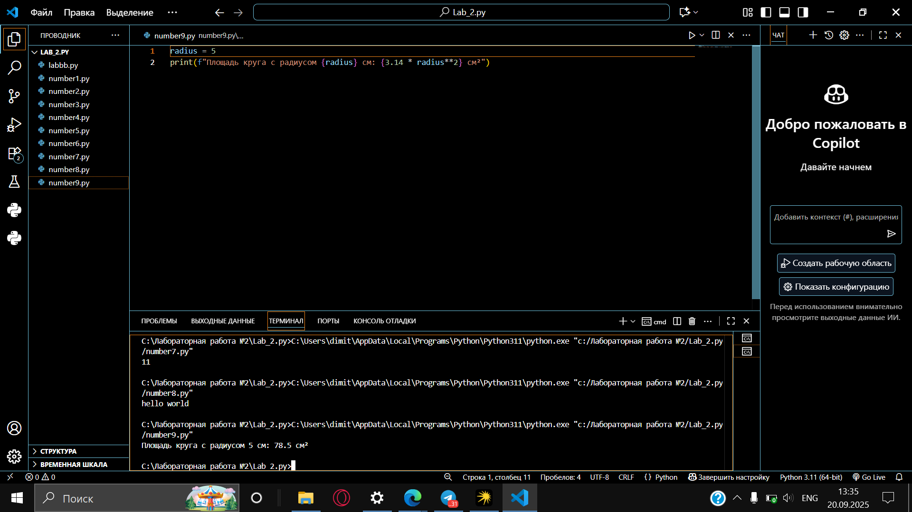

## Выводы
Код демонстрирует работу с числовыми значениями: умножение двух переменных для вычисления площади прямоугольника и использование f-строки для форматированного вывода результата.

## Самостоятельная работа №10
### Самостоятельно придумайте задачу по проходимой теме и решите ее. Задача должна быть связана со взаимодействием со строковыми значениями.

```python
text = 'программирование'
print(f"Первые пять символов:'{text[:5]}', последние 5: '{text[-5:]}'")
```

## Результат
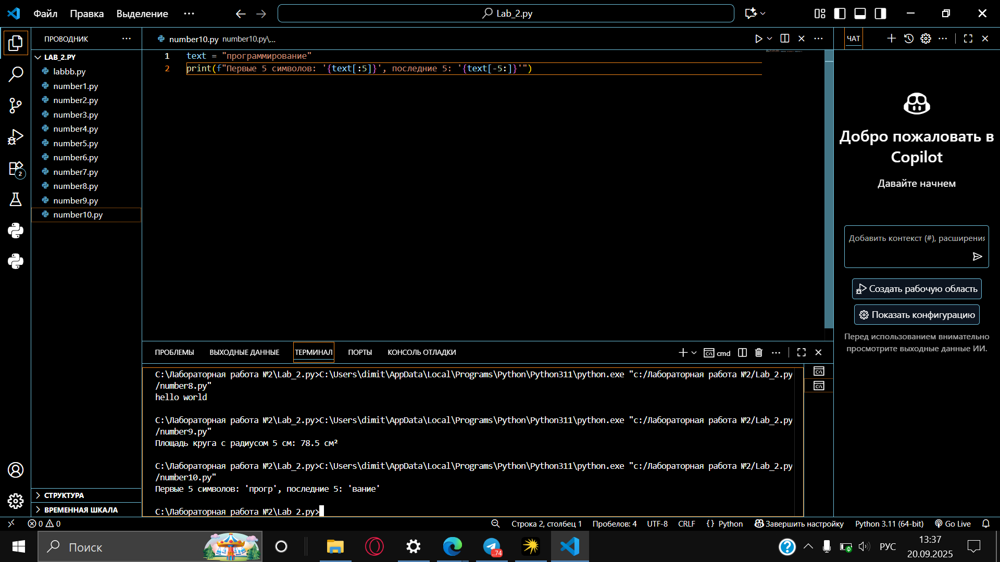

## Выводы
В данном коде демонстрируется работа со строковыми срезами (slicing) в Python. Переменная text содержит строку 'программирование'.

С помощью среза text[:5] мы получаем первые пять символов строки (с 0-го по 4-й включительно), что дает подстроку 'програм'.

С помощью среза text[-5:] мы получаем последние пять символов строки (с 5-го символа с конца до конца строки), что дает подстроку 'ание'.

Результат выводится с использованием f-строки, которая позволяет удобно вставлять значения переменных и выражений в строку вывода.
