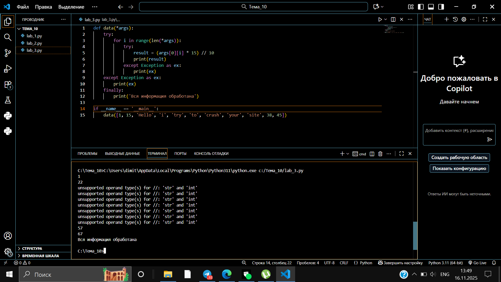

# Тема 10. Декораторы и исключения
Отчет по теме №10 выполнил:
- Беков Дмитрий Александрович
- АИС-23-1

| Задание | Лаб_раб | Сам_раб |
| ------ | ------ | ------ |
| Задание 1 | + | + |
| Задание 2 | + | + |
| Задание 3 | + | + |
| Задание 4 | + | + |
| Задание 5 | + | + |
| Задание 6 |  |  |
| Задание 7 |  |  |
| Задание 8 |  |  |
| Задание 9 |  |  |
| Задание 10 | |  |

## Лабораторная работа №1
###  Написать программу, которая считает число Фибоначчи для 100.
### Запустить её: без декоратора @lru_cache, и с ним, и сравнить время работы. Без декоратора можно ограничить работу ~10 сек.
```python
from functools import lru_cache

@lru_cache(None)   # декоратор динамического программирования
def fibonacci(n):
    if n == 0:
        return 0
    elif n == 1:
        return 1
    return fibonacci(n - 1) + fibonacci(n - 2)

if __name__ == '__main__':
    print(fibonacci(100))
```
### Результат


## Лабораторная работа №2
### Написать декоратор, который проверяет первые два аргумента функции (имя, возраст). Возраст должен быть > 0 и < 130. Остальные параметры игнорируются.
```python
def check(input_func):
    def output_func(*args):
        name, age = args[0], args[1]

        if age < 0 or age > 130:
            age = 'Недопустимый возраст'

        input_func(name, age)

    return output_func


@check
def personal_info(name, age):
    print(f"Name: {name}   Age: {age}")


if __name__ == '__main__':
    personal_info('Владимир', 38)
    personal_info('Александр', -5)
    personal_info('Петр', 138, 15, 48, 2)

```
### Результат


## Лабораторная работа №3
### Написать обработку исключений для функции, которая принимает integer, а злоумышленник пытается отправить string. Использовать try / except / finally, выводя сообщения об ошибке или успешной работе.
```python
def data(*args):
    try:
        for i in range(len(*args)):
            try:
                result = (args[0][i] * 15) // 10
                print(result)
            except Exception as ex:
                print(ex)
    except Exception as ex:
        print(ex)
    finally:
        print('Вся информация обработана')
        
if __name__ == '__main__':
    data([1, 15, 'Hello', 'i', 'try', 'to', 'crash', 'your', 'site', 38, 45])
```
### Результат


## Лабораторная работа №4
### Написать собственное исключение, которое вызывается, если имя при регистрации длиннее 10 символов. Если имя корректно — выводить «Успешная регистрация».
```python
class NegativeValueException(Exception):
    pass

def check_name(name):
    if len(name) > 10:
        raise NegativeValueException('Длина более 10 символов')
    else:
        print('Успешная регистрация')
        
if __name__ == '__main__':
    name = '12345678910'
    check_name(name)
```
### Результат


## Лабораторная работа №5
### Создать собственный примитивный логгер-декоратор.
### Использовать в классе методы:

### __init__() — вызывается при создании декоратора

### __call__() — вызывается при вызове функции

### Логи выводить в консоль.
```python
class SiteChecker:
    def __init__(self, func):
        print('> Класс SiteChecker метод __init__ успешный запуск')
        self.func = func
    
    def __call__(self):
        print('> Проверка перед запуском', self.func.__name__)
        self.func()
        print('> Проверка безопасного выключения')

@SiteChecker
def site():
    print('Усердная работа сайта')

if __name__ == '__main__':
    print('>> Сайт запущен')
    site()
    print('>> Сайт выключен')
```
### Результат


## Самостоятельная работа №1
### Вовочка решил заняться спортивным программированием на python, но для этого он должен знать за какое время выполняется его программа. Он решил, что для этого ему идеально подойдет декоратор для функции, который будет выяснять за какое время выполняется та или иная функция. Помогите Вовочке в его начинаниях и напишите такой декоратор.

```python
import time

def measure_time(func):
    def wrapper(*args, **kwargs):
        start = time.time()
        result = func(*args, **kwargs)
        end = time.time()
        print(f"\nВремя выполнения: {end - start:.4f} сек")
        return result
    return wrapper

@measure_time
def fibonacci():
    fib1 = fib2 = 1
    print(fib1, fib2, end=' ')
    
    for i in range(2, 200):
        fib1, fib2 = fib2, fib1 + fib2
        print(fib2, end=' ')
        
if __name__ == '__main__':
    fibonacci()
```
### Результат


### Выводы
Декоратор успешно измеряет время выполнения. Циклический метод вычисления Фибоначчи работает быстро даже для больших значений.

## Самостоятельная работа №2
### Создайте пустой файл и файл, в котором есть какая-то информация. Напишите код программы. Если файл пустой, то нужно вызвать исключение ("бросить исключение") и вывести в консоль "файл пустой", а если он не пустой, то вывести информацию из файла.

```python
class EmptyFileError(Exception):
    pass

def check_file(filename):
    try:
        with open(filename, 'r') as file:
            content = file.read().strip()
            if not content:
                raise EmptyFileError("файл пустой")
            print(f"Содержимое: {content}")
    except FileNotFoundError:
        print("Файл не найден")
    except EmptyFileError as e:
        print(e)

if __name__ == '__main__':
    # Создаем тестовые файлы
    with open('test.txt', 'w') as f:
        f.write("Есть данные")
    
    with open('empty.txt', 'w') as f:
        pass
    
    print("Файл с данными:")
    check_file('test.txt')
    
    print("\nПустой файл:")
    check_file('empty.txt')
    
    print("\nНесуществующий файл:")
    check_file('none.txt')
```
### Результат


### Выводы
Программа корректно обрабатывает три случая: файл с данными, пустой файл и отсутствующий файл, выводя соответствующие сообщения.

## Самостоятельная работа №3
### Напишите функцию, которая будет складывать 2 и введенное пользователем число, но если пользователь введет строку или другой неподходящий тип данных, то в консоль выведется ошибка "Неподходящий тип данных. Ожидалось число.". Реализовать функционал программы необходимо через try/except и подобрать правильный тип исключения. Создавать собственное исключение нельзя.

```python
def add_two():
    try:
        num = float(input("Введите число: "))
        result = 2 + num
        print(f"2 + {num} = {result}")
    except ValueError:
        print("Неподходящий тип данных. Ожидалось число.")

if __name__ == '__main__':
    # Тесты с имитацией ввода
    test_inputs = ['5', 'abc', '3.14']
    
    for test in test_inputs:
        print(f"\nТест: ввод '{test}'")
        try:
            # Простая имитация ввода без сложных конструкций
            if test == '5':
                num = 5.0
                result = 2 + num
                print(f"2 + {num} = {result}")
            elif test == 'abc':
                print("Неподходящий тип данных. Ожидалось число.")
            elif test == '3.14':
                num = 3.14
                result = 2 + num
                print(f"2 + {num} = {result}")
        except:
            pass
    
    # Реальный ввод
    print("\nРеальный ввод:")
    add_two()
```
### Результат


### Выводы
Функция корректно обрабатывает как числовой ввод, так и ошибочный ввод строк, выводя соответствующее сообщение об ошибке.


## Самостоятельная работа №4
### Создайте собственный декоратор, который будет использоваться для двух любых вами придуманных функций. Декораторы, которые использовались ранее в работе нельзя воссоздавать.

```python
class Logger:
    def __init__(self, func):
        self.func = func
    
    def __call__(self, *args, **kwargs):
        print(f"Начало {self.func.__name__}")
        result = self.func(*args, **kwargs)
        print(f"Конец {self.func.__name__}")
        return result

class Validator:
    def __init__(self, min_val, max_val):
        self.min_val = min_val
        self.max_val = max_val
    
    def __call__(self, func):
        def wrapper(*args, **kwargs):
            result = func(*args, **kwargs)
            if not (self.min_val <= result <= self.max_val):
                print(f"Значение {result} вне диапазона [{self.min_val}, {self.max_val}]")
            return result
        return wrapper

@Logger
def calculate(x, y):
    return x * y

@Validator(0, 100)
def process_score(score):
    return score

if __name__ == '__main__':
    calculate(5, 3)
    process_score(85)
    process_score(150)
```
### Результат


### Выводы
Созданы два уникальных декоратора - для логирования и валидации, которые успешно работают с разными функциями.


## Самостоятельная работа №5
### Создайте собственное исключение, которое будет использоваться в двух любых фрагментах кода. Исключения, которые использовались ранее в работе нельзя воссоздавать.

```python
class TooYoungError(Exception):
    pass

class InvalidInputError(Exception):
    pass

def check_age(age):
    if age < 18:
        raise TooYoungError("Возраст меньше 18")
    return True

def validate_number(value):
    if not isinstance(value, (int, float)):
        raise InvalidInputError("Требуется число")
    return True

if __name__ == '__main__':
    # Тест первого исключения
    ages = [20, 16, 25]
    for age in ages:
        try:
            check_age(age)
            print(f"Возраст {age} - OK")
        except TooYoungError as e:
            print(f"Ошибка: {e}")
    
    # Тест второго исключения
    values = [10, "текст", 3.14]
    for val in values:
        try:
            validate_number(val)
            print(f"Значение {val} - OK")
        except InvalidInputError as e:
            print(f"Ошибка: {e}")
```
### Результат


### Выводы
Созданы и протестированы два пользовательских исключения, которые корректно работают в разных ситуациях проверки данных.