# Тема 3. Операторы, условия, циклы.
Отчет по теме №2 выполнил:
- Беков Дмитрий Александрович
- АИС-23-1

| Задание | Лаб_раб | Сам_раб |
| ------ | ------ | ------ |
| Задание 1 | + | + |
| Задание 2 | + | + |
| Задание 3 | + | + |
| Задание 4 | + | + |
| Задание 5 | + | + |
| Задание 6 | + | - |
| Задание 7 | + | - |
| Задание 8 | + | - |
| Задание 9 | + | - |
| Задание 10 | + | - |

## Лабораторная работа №1
### Создайте две переменные, значение которых будете вводить через консоль. Составьте условие, в котором эти переменные сравниваются. Если условие выполняется, выведите в консоль «Выполняется», если нет — «Не выполняется».
```python
var1 = input('Введите значение первой переменной: ')
var2 = input('Введите значение второй переменной: ')

if var1 == var2:
    print('Выполняется')
else:
    print('Не выполняется')
```
### Результат
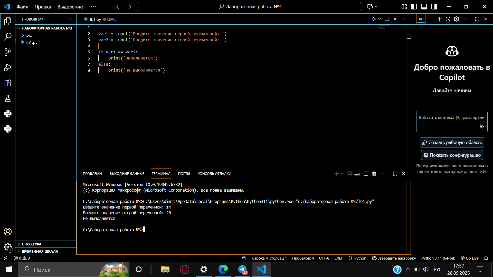


## Лабораторная работа №2
### Напишите программу, которая будет определять, попадает ли значение переменной в один из диапазонов: меньше 0, больше 0 и меньше 10, или больше 10. Значение переменной вводится через консоль. Для проверки используйте конструкцию if, elif, else.

```python
one = int(input('Введите значение переменной: '))
if one < 0:
    print('Переменная меньше 0')
elif 0 < one < 10:
    print('Переменная больше 0 и меньше 10')
else:
    print('Переменная больше 10')
```

### Результат
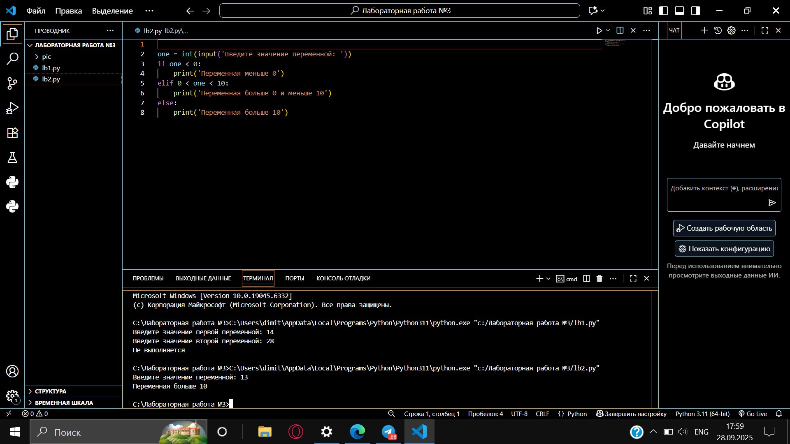

## Лабораторная работа №3
### Напишите программу, которая проверяет, присутствует ли значение переменной в указанном массиве (списке), используя логический оператор in. Протестируйте работу программы со значениями, которые есть в массиве, и которые отсутствуют.

```python
numbers = [1, 3, 4, 6, 8, 9]
value = int(input('Введите значение переменной: '))
if value in numbers:
    print('Переменная есть в данном массиве')
else:
    print('Переменной нет в этом массиве')
```

### Результат
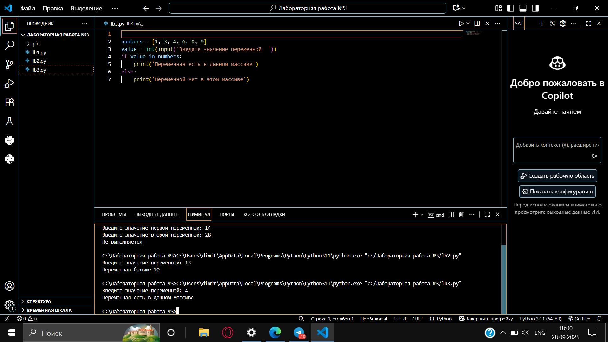

## Лабораторная работа №4
### Напишите программу, которая сначала определяет, находится ли переменная в указанном массиве, и если да, то проверяет, является ли она чётной. Протестируйте программу с разными значениями переменной.

```python
numbers = [1, 3, 4, 6, 8, 9, 15, 16, 73, 321, 322]
value = int(input('Введите значение переменной: '))
if value in numbers:
    if value % 2 == 0:
        print('Переменная четная и есть в массиве numbers')
    else:
        print('Переменная нечетная и есть в массиве numbers')
else:
    print(f"Переменной нет в массиве numbers и она равна {value}")
```

### Результат
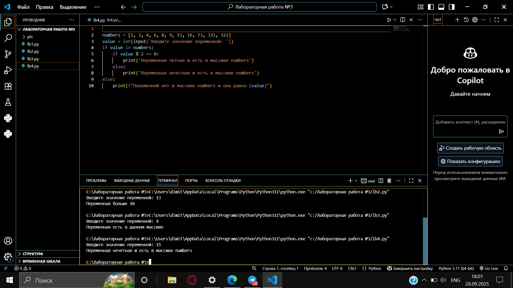

## Лабораторная работа №5
### Напишите программу, в которой цикл for изменяет значение переменной i от 0 до 10. Изучите, как работают различные виды сравнений и операций внутри цикла.

```python
for i in range(10):
    print('i = ', i)
    if i == 0:
        i += 2
    if i == 1:
        continue
    if i == 2 or i == 3:
        print('Переменная равна 2 или 3')
    elif i in [4, 5, 6]:
        print('Переменная равна 4, 5 или 6')
    else:
        break
```

### Результат
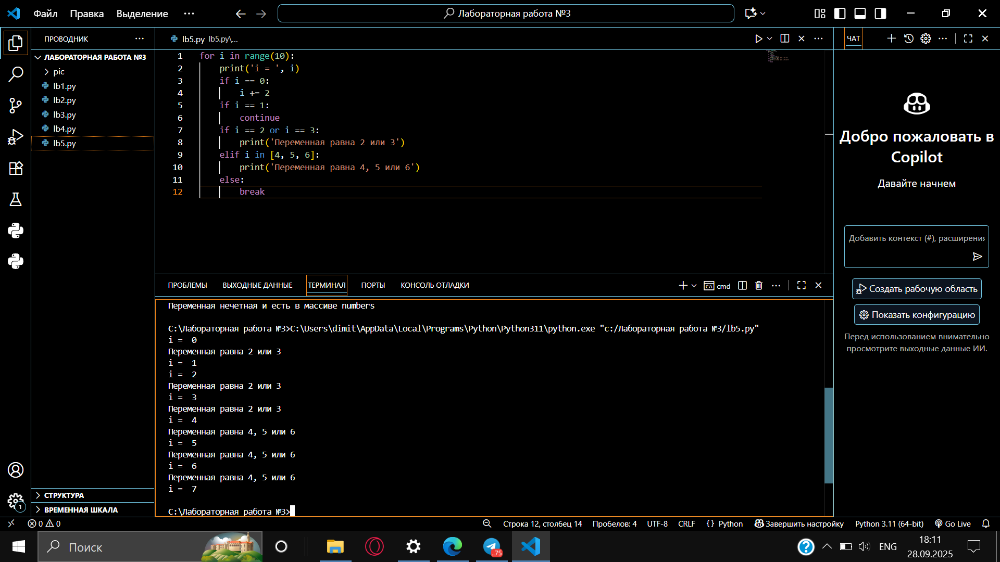

## Лабораторная работа №6
### Напишите программу, которая с помощью цикла for проверяет, содержится ли переменная value в строке string. Изучите, как работает блок else для циклов. Дополнительно (по желанию) определите индекс найденного элемента с помощью метода string.find(value).

```python
string = 'Привет всем изучающим Python!'
value = input()
for i in string:
    if i == value:
        if i == value:
            index = string.find(value)
            print(f"Буква '{value}' есть в строке под {index} индексом")
            break
else:
    print(f"Буквы '{value}' нет в указанной строке")
```

### Результат
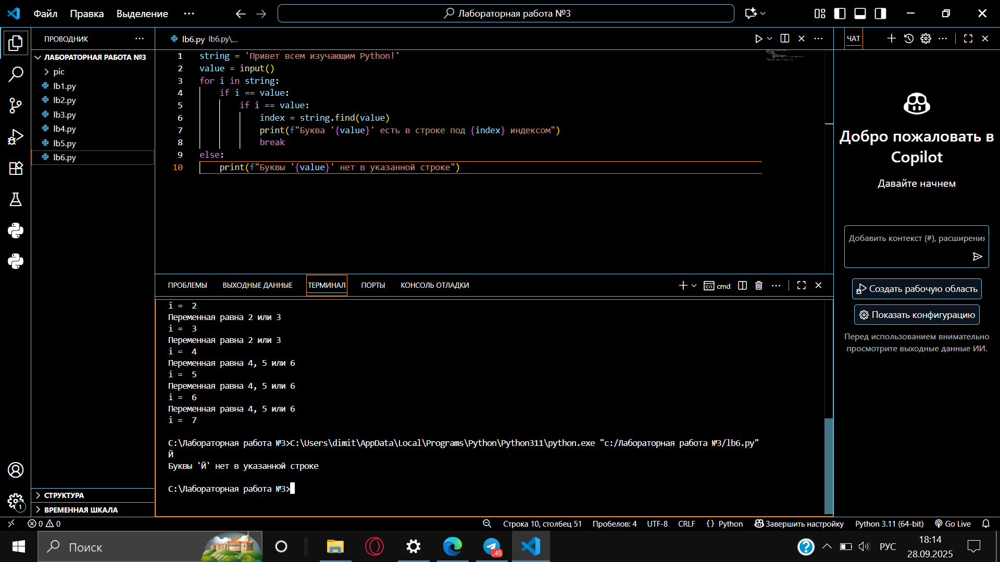

## Лабораторная работа №7
### Напишите программу, которая наглядно демонстрирует работу цикла for в обратном порядке (например, от 10 до 0). Придумайте и реализуйте свой собственный пример применения такого обратного цикла.

```python
for i in range(10, -1, -1):
    print(i)


print("\nОбратная таблица умножения на 5:")
for i in range(10, 0, -1):
    print(f"5 × {i} = {5*i}")
```

### Результат
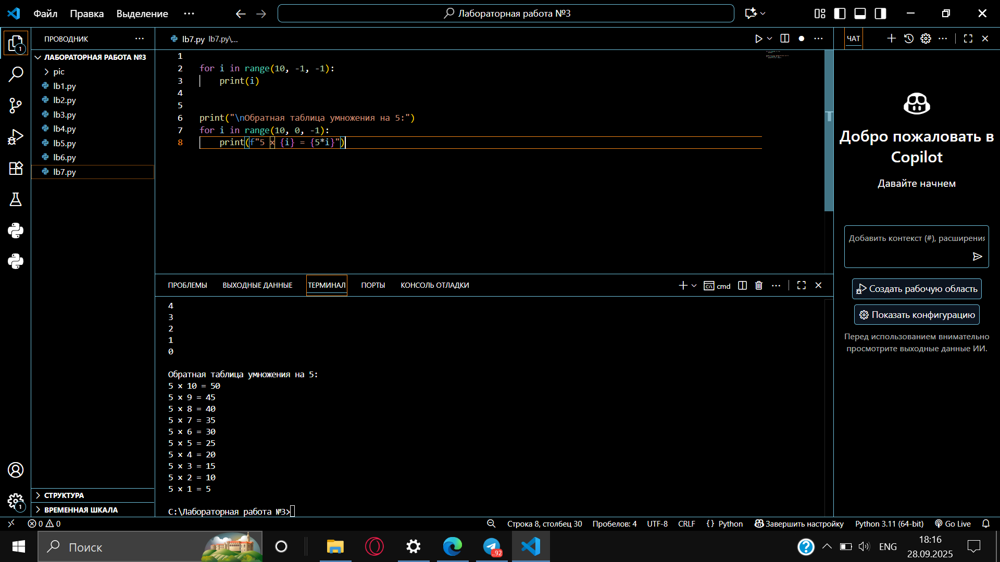

## Лабораторная работа №8
### Напишите программу, используя цикл while, внутри которого выполняются какие-либо проверки. Будьте осторожны с условием, чтобы избежать создания бесконечного цикла.

```python
value = 0
while value < 100:
    if value == 0:
        value += 10
    elif value // 5 > 1:  
    else:
        value -= 5
    print(value)
```

### Результат
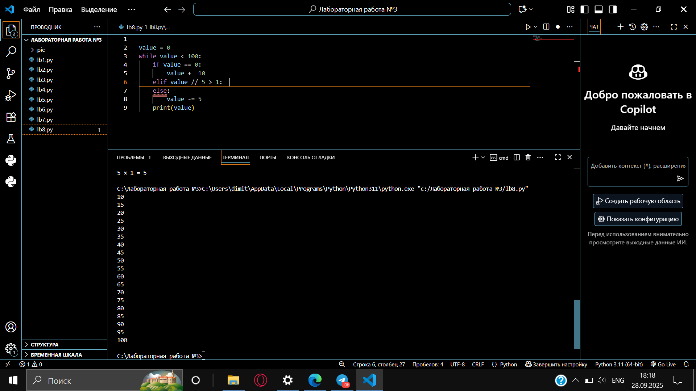

## Лабораторная работа №9
### Напишите программу с использованием вложенных циклов и хотя бы одной проверкой (условием) внутри них. Убедитесь, что для вложенных циклов используются разные имена итерируемых переменных.

```python
value = 0
for i in range(10):
    for j in range(10):  
        if i != j:
            value += j
        else:
            pass 

print(value)
```

### Результат
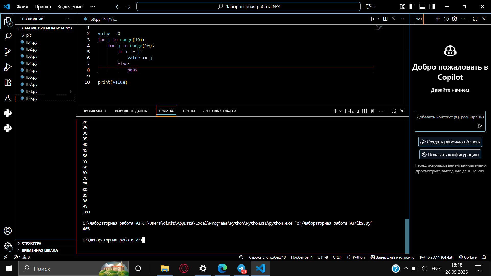

## Лабораторная работа №10
### Напишите программу, которая с использованием флага (flag) определяет, есть ли в массиве чётных чисел хотя бы одно нечётное число. Флаг должен выступать в роли индикатора обнаружения нечётного числа.

```python
even_array = [2, 4, 6, 8, 9]
flag = False
for value in even_array:
    if value % 2 == 1:
        flag = True


if flag: 
    print("В массиве есть нечетное число")
else:
    print("В массиве все числа четные")
```

### Результат
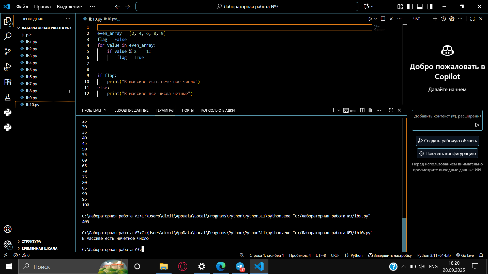

## Самостоятельная работа №1
### Напишите программу, которая преобразует 1 в 31.Для выполнения поставленной задачи необходимо обязательно и только один раз использовать:
### - Цикл for
### - *= 5
### - += 1
### Никаких других действий или циклов использовать нельзя.

```python
x = 1
for _ in range(2):
    x *= 5
    x += 1
print(x)
```
### Результат


## Выводы
Программа инициализирует переменную x значением 1, затем дважды выполняет цикл, в котором умножает x на 5 и прибавляет 1. После первого прохода: 1×5+1=6, после второго: 6×5+1=31.

## Самостоятельная работа №2
### Напишите программу, которая фразу «Hello World» выводит в обратном порядке, и каждая буква находится в одной строке консоли. При этом необходимо обязательно использовать любой цикл, а также программа должна занимать не более 3 строк в редакторе кода.

```python
for char in "Hello World"[::-1]:
    if char != ' ': print(char)
```
### Результат


### Выводы
Напишите программу, которая фразу «Hello World» выводит в
обратном порядке, и каждая буква находится в одной строке консоли.
При этом необходимо обязательно использовать любой цикл, а также
программа должна занимать не более 3 строк в редакторе кода.

## Самостоятельная работа №3
### Напишите программу, на вход которой поступает значение из консоли, оно должно быть числовым и в диапазоне от 0 до 10 включительно (это необходимо учесть в программе). Если вводимое число не подходит по требованиям, то необходимо вывести оповещение об этом в консоль и остановить программу. Код должен вычислять в каком диапазоне находится полученное число. Нужно учитывать три диапазона:

### - от 0 до 3 включительно
### - от 3 до 6
### - от 6 до 10 включительно

### Результатом работы программы будет выведенный в консоль диапазон.
### Программа должна занимать не более 10 строчек в редакторе кода.

```python
num = int(input("Введите число от 0 до 10: "))
if num < 0 or num > 10:
    print("Число не в диапазоне от 0 до 10")
    exit()
if num <= 3:
    print("Диапазон: от 0 до 3 включительно")
elif num < 6:
    print("Диапазон: от 3 до 6")
else:
    print("Диапазон: от 6 до 10 включительно")
```
### Результат


### Выводы
Программа проверяет корректность введенного числа (0-10), и в зависимости от значения определяет принадлежность к одному из трех диапазонов.


## Самостоятельная работа №4
### Манипулирование строками. Напишите программу на Python, которая принимает предложение (на английском) в качестве входных данных от пользователя. Выполните следующие операции и отобразите результаты:

### - Выведите длину предложения.
### - Переведите предложение в нижний регистр.
### - Подсчитайте количество гласных (a, e, i, o, u) в предложении.
### - Замените все слова "ugly" на "beauty".
### - Проверьте, начинается ли предложение с "The" и заканчивается ли на "end".

### Проверьте работу программы минимум на 3 предложениях, чтобы охватить проверку всех поставленных условий.

```python
sentence = input("Введите предложение: ")
print("Длина предложения:", len(sentence))
lower_sentence = sentence.lower()
print("Предложение в нижнем регистре:", lower_sentence)
vowels = 'aeiou'
count = sum(1 for char in lower_sentence if char in vowels)
print("Количество гласных:", count)
replaced_sentence = sentence.replace('ugly', 'beauty')
print("После замены 'ugly' на 'beauty':", replaced_sentence)
print("Начинается с 'The':", sentence.startswith('The'))
print("Заканчивается на 'end':", sentence.endswith('end'))
```
### Результат
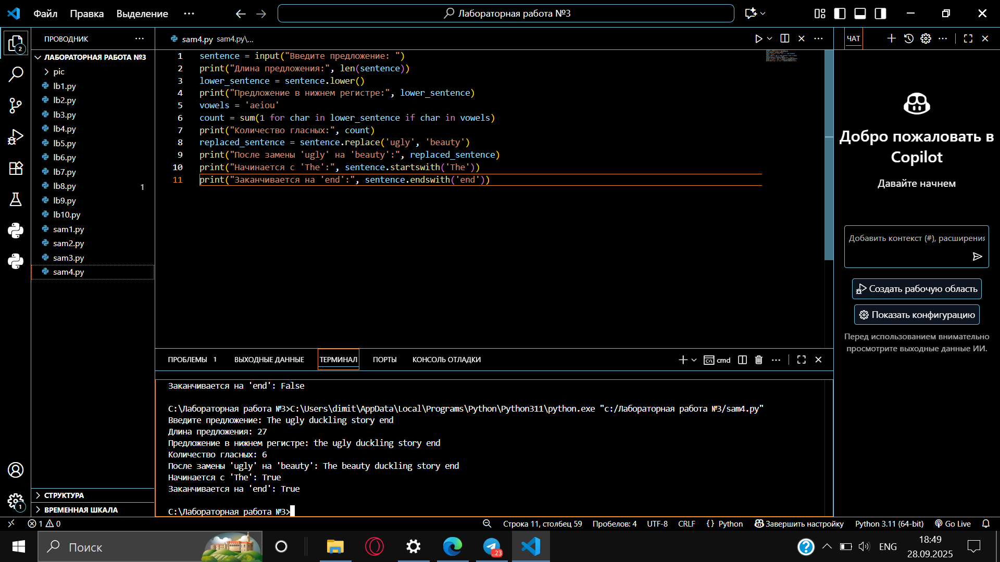
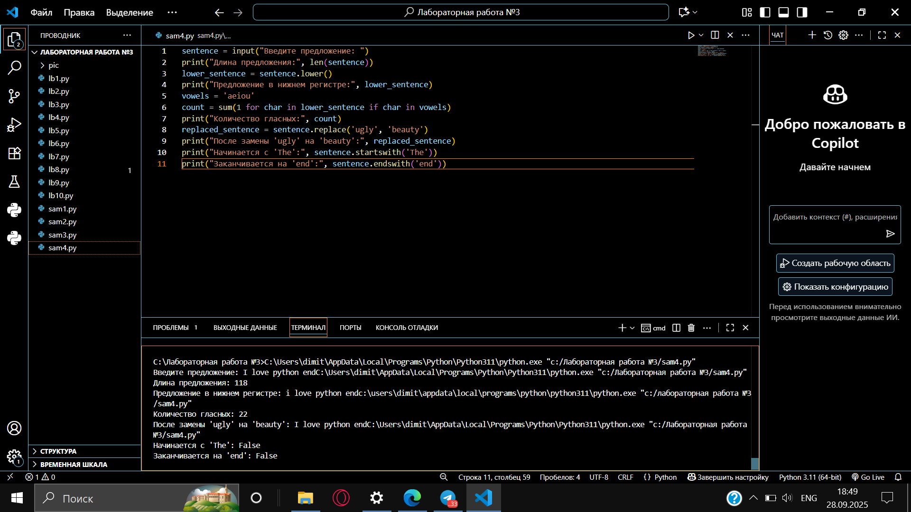
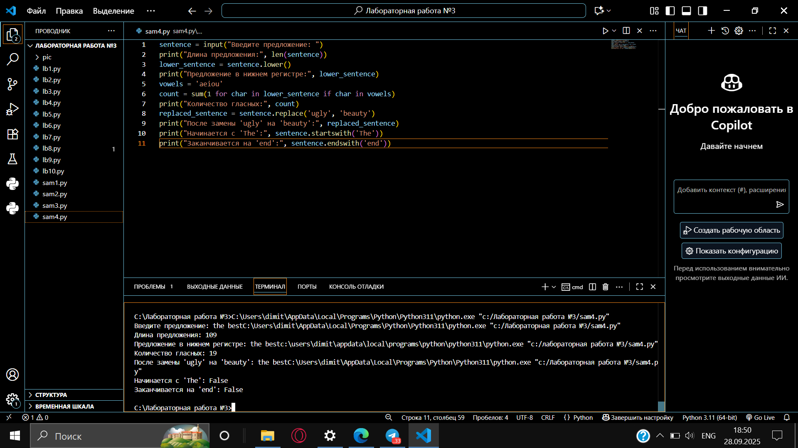

### Выводы
Программа выполняет комплексный анализ введенного предложения: вычисляет длину, преобразует регистр, подсчитывает гласные буквы, заменяет слова и проверяет начало/конец строки.


## Самостоятельная работа №5
### Составьте программу, результатом которой будет данный вывод в консоль:

```python
counter = 0
while counter != 10:
    values = [0, 2, 4, 6, 8, 10]
    if counter in values:
        string = 'hello'
        string = string + ' world'
        print(string)
        string = 'hello'
        print(string)
    counter += 1
```
### Результат
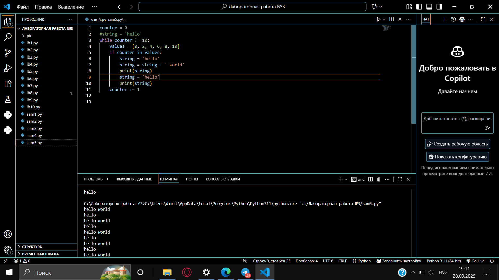

### Выводы
Программа использует доступные фрагменты кода для последовательного вывода строк "hello", "world" и их конкатенации "helloworld". Условие if выполняется, так как counter=0 присутствует в массиве values.