# Тема 5. Базовые коллекции: строки и списки.
 Отчет по теме №5 выполнил:
- Беков Дмитрий Александров
- АИС-23-1

| Задание | Лаб_раб | Сам_раб |
| ------ | ------ | ------ |
| Задание 1 | + | + |
| Задание 2 | + | + |
| Задание 3 | + | + |
| Задание 4 | + | + |
| Задание 5 | + | + |
| Задание 6 | + | - |
| Задание 7 | + | - |
| Задание 8 | + | - |
| Задание 9 | + | - |
| Задание 10 | + | - |

## Лабораторная работа №1
### Друзья предложили вам поиграть в игру “найди отличия и убери повторения (версия для программистов)”. Суть игры состоит в том, что на вход программы поступает два множества, а ваша задача вывести все элементы первого, которых нет во втором. А вы как раз недавно прошли множества и знаете их возможности, поэтому это не составит для вас труда.

```python
set_1 = {'White', 'Black', 'Red', 'Pink'}
set_2 = {'Red', 'Green', 'Blue', 'Red'}
print('1', set_1 - set_2)

set_1 = {'White', 'Black', 'Red', 'Pink', 'Black', 'White'}
set_2 = {'Red', 'Green', 'Blue', 'Red'}
print('2', set_1 - set_2)

set_1 = {'White', 'Black', 'Red', 'Pink', 'Red', 'Red'}
set_2 = {'Red', 'Green', 'Red', 'Red', 'Red'}
print('3', set_1 - set_2)
```
### Результат
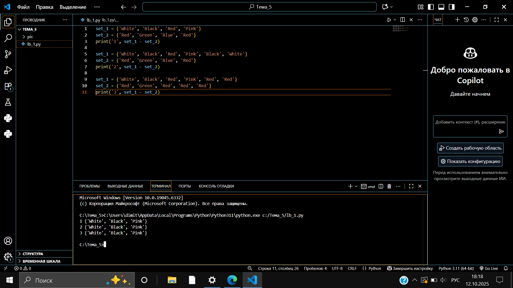


## Лабораторная работа №2
### Напишите две одинаковые программы, только одна будет использовать set(), а вторая frozenset() и попробуйте к исходному множеству добавить несколько элементов, например, через цикл.
```python
a = set('abcdefg')
print(a)
for i in range(1, 5):
    a.add(i)
print(a)
```
```python
a = frozenset('abcdefg')
print(a)
```
### Результат
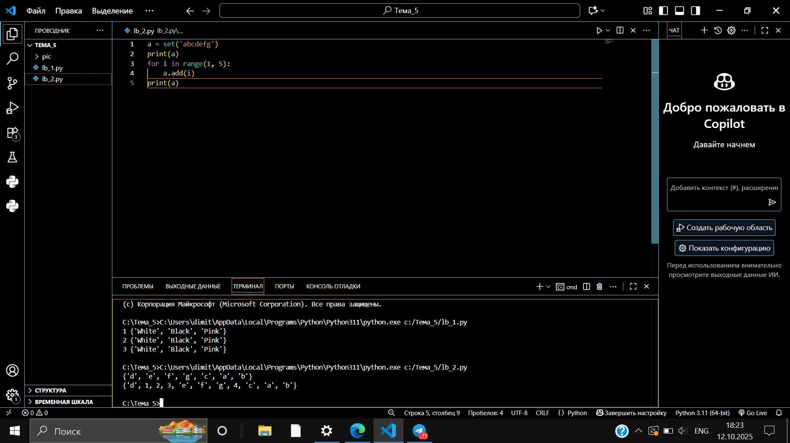
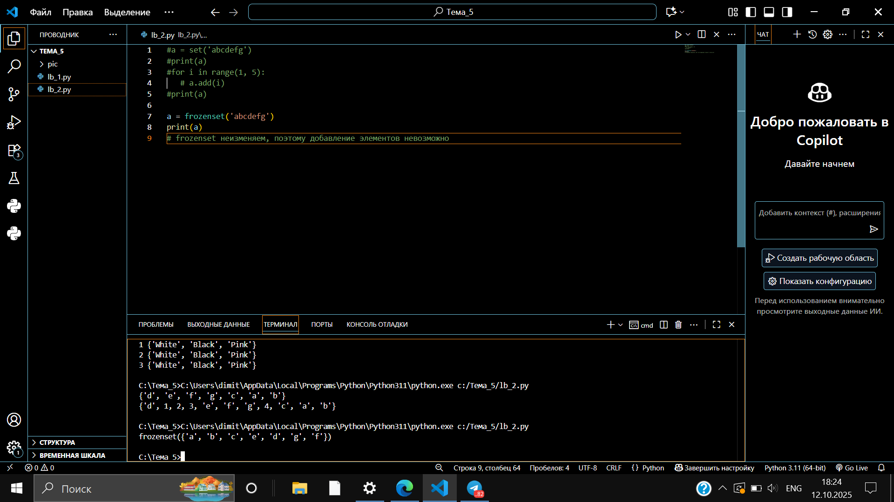
## Лабораторная работа №3
### На вход в программу поступает список (минимальной длиной 2 символа). Напишите программу, которая будет менять первый и последний элемент списка.

```python
my_list = [2, 5, 8, 3]
my_list[0], my_list[-1] = my_list[-1], my_list[0]
print(my_list)
```
### Результат
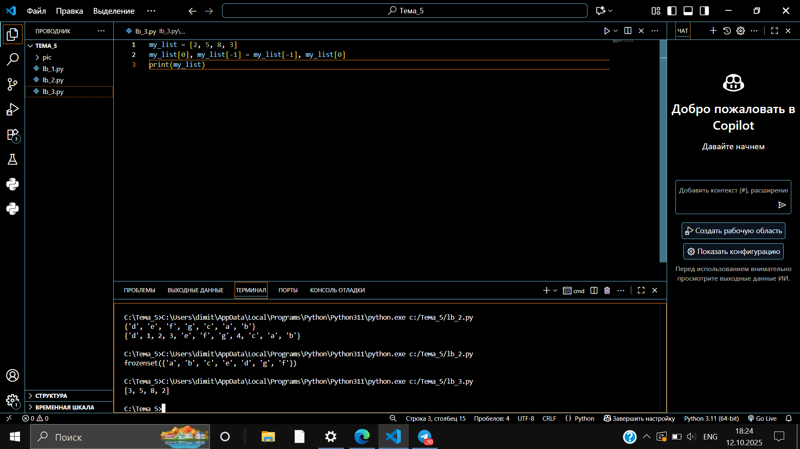
## Лабораторная работа №4
### На вход в программу поступает список (минимальной длиной 10 символов). Напишите программу, которая выводит элементы с индексами от 2 до 6. В программе необходимо использовать “cpe3”.
```python
my_list = [0, 1, 2, 3, 4, 5, 6, 7, 8, 9]
print(my_list[2:7])  # срезы: от 2 до 6 включительно
```
### Результат
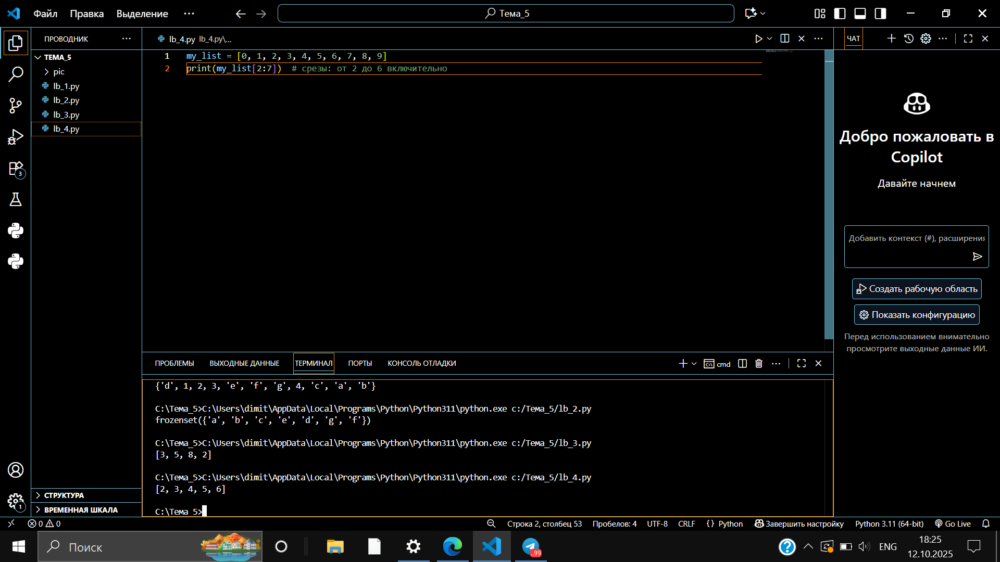
## Лабораторная работа №5
### Иван задумался о поиске «бесполезного» числа, полученного из списка. Суть поиска в следующем: он берет произвольный список чисел, находит самое большое из них, а затем делит его на длину списка. Студент пока не придумал, где может пригодиться подобное значение, но ищет у вас помощи в реализации такой функции useless().
```python
def useless(lst):
    return max(lst) / len(lst)

print(useless([1, 5, 77, 22, 3]))
```
### Результат
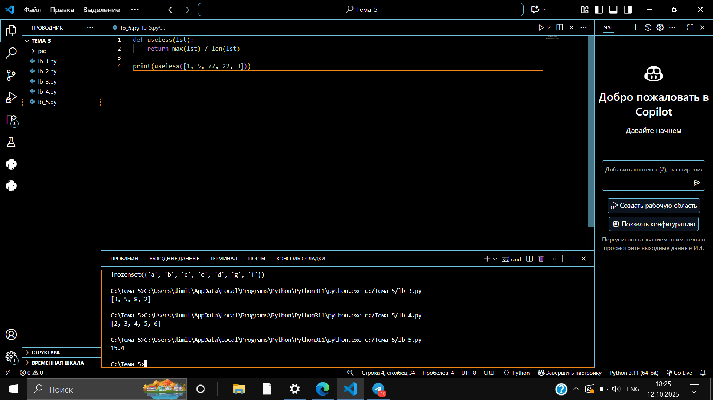
## Лабораторная работа №6
### Ребята не могут определится каким супергероем они хотят стать. У них есть случайно составленный список супергероев, и вы должны определить кто из ребят будет каким супергероем. Необходимо использовать разделение списков.
```python
superheroes = ['superman', 'spiderman', 'batman']

nikolay, vasiliy, ivan = superheroes

print('Николай - ', nikolay)
print('Василий - ', vasiliy)
print('Иван - ', ivan)
```
### Результат
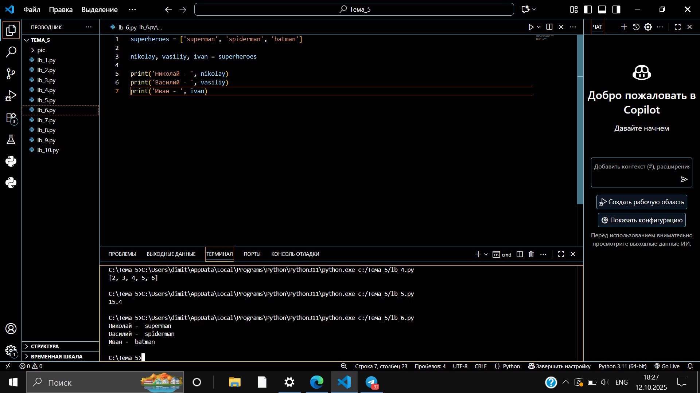
## Лабораторная работа №7
### Вовочка, насмотревшись передачи “Слабое звено” решил написать программу, которая также будет находить самое слабое звено (минимальный элемент) и удалять его, только делать он это хочет не с людьми, а со списком. Помогите Вовочке с реализацией программы. Подсказка: для этого вам необходимо отсортировать список и удалить значение при помощи pop().
```python
a = [-25.8, 86, 12.5, -56, 73.2, 0, 43, -91.5, 65.9, -7]
a.sort()
print('Отсортированный список:\n', a)
a.pop(0)
print('Отсортированный список без наименьшего элемента:\n', a)
```
### Результат
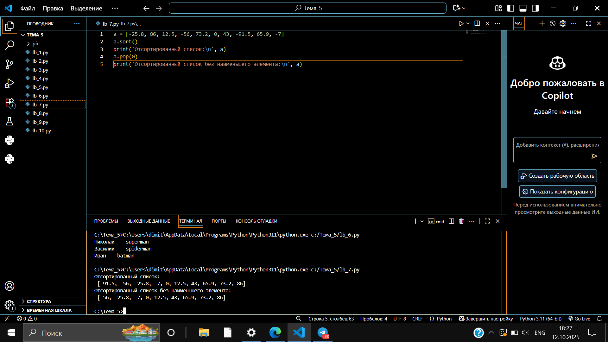
## Лабораторная работа №8
### Михаил решил создать большой n-мерный список, для этого он случайным образом создал несколько списков, состоящих минимум из 3, а максимум из 10 элементов и поместил их в один большой список. Он также как и Иван не знает зачем ему это сейчас нужно, но надеется на то, что это пригодится ему в будущем.
```python
from random import randint

def list_maker():
    a = [randint(1, 100)] * randint(3, 10)
    return a

if __name__ == '__main__':
    result = []
    for i in range(randint(1, 5)):
        result.append(list_maker())
    print(result)
```
### Результат
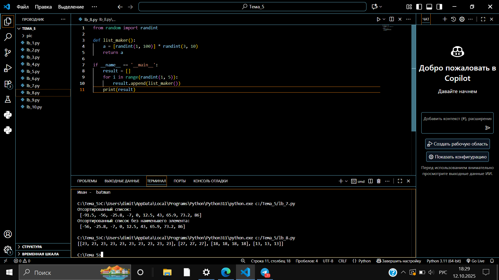
## Лабораторная работа №9
### Вы работаете в ресторане и отвечает за статистику покупок, ваша задача сравнить между собой заказы покупателей, которые указаны в разном порядке. Реализуйте функцию superset(), которая принимает 2 множества. Результат работы функции: вывод в консоль одного из сообщений в зависимости от ситуации:

### 1 - «Супермножество не обнаружено»
### 2 – «Объект {X} является чистым супермножеством»
### 3 – «Множества равны»
```python
def superset(set_1, set_2):
    if set_1 > set_2:
        print(f'Объект {set_1} является чистым супермножеством')
    elif set_1 == set_2:
        print('Множества равны')
    elif set_1 < set_2:
        print(f'Объект {set_2} является чистым супермножеством')
    else:
        print('Супермножество не обнаружено')

if __name__ == '__main__':
    superset({1, 8, 3, 5}, {3, 5})
    superset({1, 8, 3, 5}, {5, 3, 8, 1})
    superset({3, 5}, {5, 3, 8, 1})
    superset({90, 100}, {3, 5})
```
### Результат
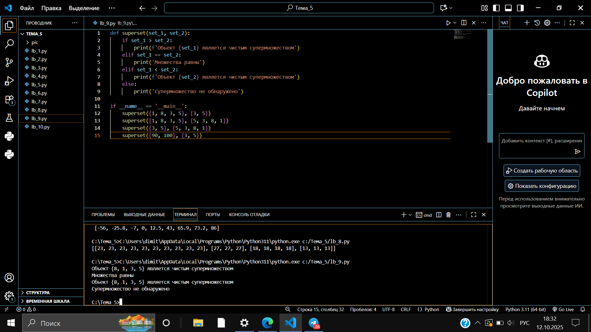
## Лабораторная работа №10
### Предположим, что вам нужно разобрать стопку бумаг, но нужно начать работу с нижней, “переверните стопку”. Вам дан произвольный список. Представьте его в обратном порядке. Программа должна занимать не более двух строк в редакторе кода.
```python
my_list = [2, 5, 8, 3]
print(my_list[::-1])
```
### Результат
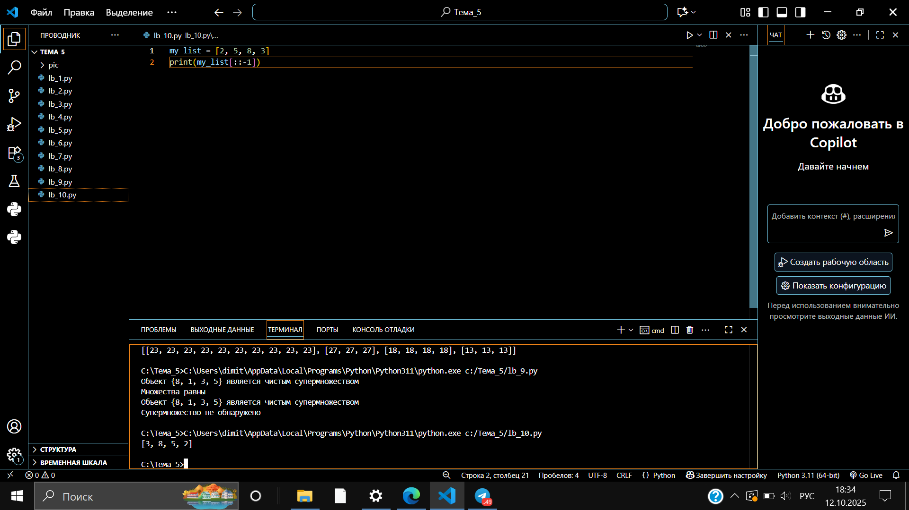


## Самостоятельная работа №1
### Ресторан на предприятии ведет учет посещений за неделю при помощи кода работника. У них есть список со всеми посещениями за неделю. Ваша задача посчитать:

### Сколько было выдано чеков

### Сколько разных людей посетило ресторан

### Какой работник посетил ресторан больше всех раз

```python
import math
from collections import Counter


visits = [8734, 2345, 8201, 6621, 9999, 1234, 5678, 8201, 8888, 4321, 3365,
          1478, 9865, 5555, 7777, 9998, 1111, 2222, 3333, 4444, 5556, 6666,
          5410, 7778, 8889, 4445, 1439, 9604, 8201, 3365, 7502, 3016, 4928,
          5837, 8201, 2643, 5017, 9682, 8530, 3250, 7193, 9051, 4506, 1987,
          3365, 5410, 7168, 7777, 9865, 5678, 8201, 4445, 3016, 4506, 4506]

total_checks = len(visits)
unique_people = len(set(visits))
most_common_worker = Counter(visits).most_common(1)[0]

print(f"Общее количество чеков: {total_checks}")
print(f"Количество уникальных посетителей: {unique_people}")
print(f"Работник с наибольшим количеством посещений: {most_common_worker[0]} (посещений: {most_common_worker[1]})")
print()

```
### Результат


## Выводы
### использует список для подсчета общего количества чеков, уникальных посетителей и наиболее частого гостя.

## Самостоятельная работа №2
### На физкультуре студенты сдавали бег, у преподавателя физкультуры есть список всех результатов, ему нужно узнать:

### Три лучшие результата

### Три худшие результата

### Все результаты начиная с 10

```python
def best_result(arr):
    sorted_arr = sorted(arr)
    best_three = sorted_arr[:3]
    worst_three = sorted_arr[-3:]
    from_10 = [r for r in sorted_arr if r >= 10]
    print(best_three)
    print(worst_three)
    print(from_10)
    
    
    
if __name__ == '__main__':
    best_result([10.2, 14.8, 19.3, 22.7, 12.5, 33.1, 38.9, 21.6, 26.4, 17.1, 30.2, 35.7, 16.9,
           27.8, 24.5, 16.3, 18.7, 31.9, 12.9, 37.4])
```
### Результат


## Выводы
### применяет сортировку и фильтрацию для анализа результатов бега.

## Самостоятельная работа №3
### Преподаватель по математике придумал странную задачку. У вас есть три списка с элементами, каждый элемент которых – длина стороны треугольника. Ваша задача найти площади двух треугольников, составленных из максимальных и минимальных элементов полученных списков.

```python
import math

one = [12, 25, 3, 48, 71]
two = [5, 18, 40, 62, 98]
three = [4, 21, 37, 56, 84]

min_sides = [min(one), min(two), min(three)]   
max_sides = [max(one), max(two), max(three)]
    
def calculate_area(a, b, c):
    p = (a + b + c) / 2
    return math.sqrt(p * (p - a) * (p - b) * (p - c))
    
area_min = calculate_area(*min_sides)
area_max = calculate_area(*max_sides)
    
print("Задание 3:")
print(f"Площадь треугольника из минимальных сторон: {area_min:.2f}")
print(f"Площадь треугольника из максимальных сторон: {area_max:.2f}")
print()

```
### Результат


## Выводы
###  вычисляет площади треугольников по формуле Герона, используя минимальные и максимальные элементы списков.

## Самостоятельная работа №4
### Никто не любит получать плохие оценки, поэтому Борис решил это исправить. Допустим, что все оценки студента за семестр хранятся в одном списке. Ваша задача удалить из этого списка все двойки, а все тройки заменить на четверки.

```python
grades_list = [
    [2, 3, 4, 5, 3, 4, 5, 2, 2, 5, 3, 4, 3, 5, 4],
    [4, 2, 3, 5, 3, 5, 4, 2, 2, 5, 4, 3, 5, 3, 4],
    [5, 4, 3, 3, 4, 3, 3, 5, 5, 3, 3, 3, 3, 4, 4]
]
    
print("Задание 4:")
for i, grades in enumerate(grades_list, 1):
    updated_grades = [4 if grade == 3 else grade for grade in grades if grade != 2]
    print(f"Обновленный список {i}: {updated_grades}")
    
```
### Результат
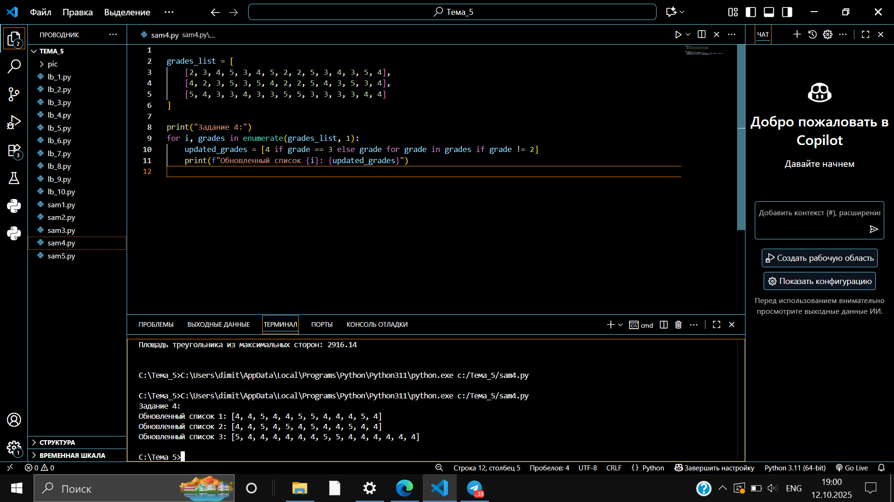

## Выводы
### показывает модификацию списков через фильтрацию и замену элементов.

## Самостоятельная работа №5
### Вам предоставлены списки натуральных чисел, из них необходимо сформировать множества. При этом следует соблюдать правило: если какое-либо число повторяется, то преобразовать его в строку по следующему образцу: например, если число 4 повторяется 3 раза, то в множестве будет следующая запись: само число 4, строка «44», строка «444».

```python
from collections import Counter

def task5():
    list_1 = [1, 1, 3, 3, 1]
    list_2 = [5, 5, 5, 5, 5, 5, 5, 5]
    list_3 = [2, 2, 1, 2, 2, 5, 6, 7, 1, 3, 2, 2]
    
    def transform_list(lst):
        result_set = set()
        counter = Counter(lst)
        for num, count in counter.items():
            result_set.add(num)
            for k in range(2, count + 1):
                result_set.add(str(num) * k)
        return result_set
    
    print("Задание 5:")
    print(f"Множество 1: {transform_list(list_1)}")
    print(f"Множество 2: {transform_list(list_2)}")
    print(f"Множество 3: {transform_list(list_3)}")

task5()
```
### Результат
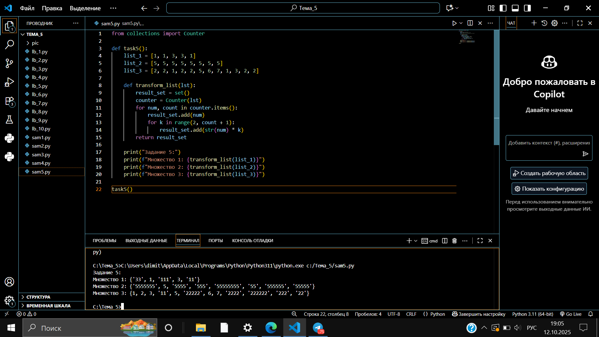

## Выводы
###  преобразует списки в множества с особыми правилами формирования строковых представлений для повторяющихся чисел.
