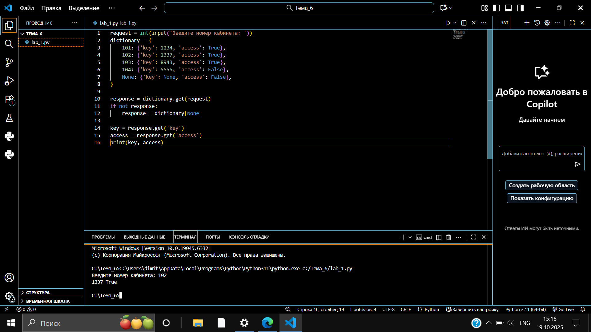
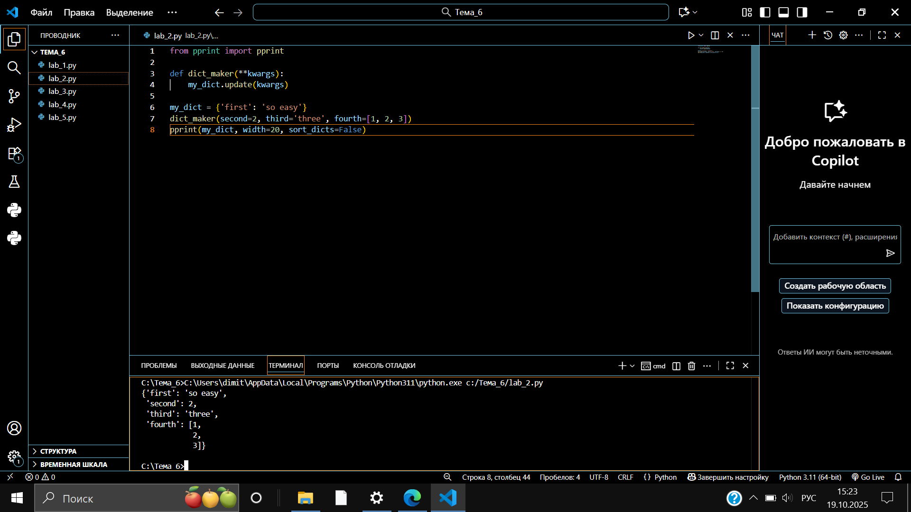
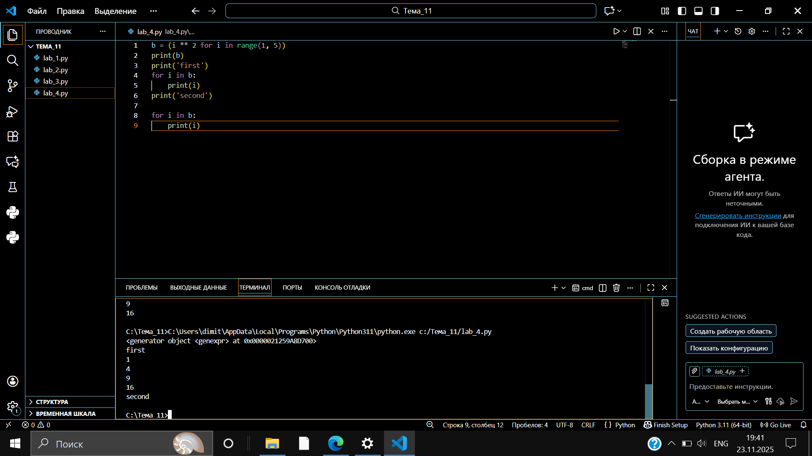
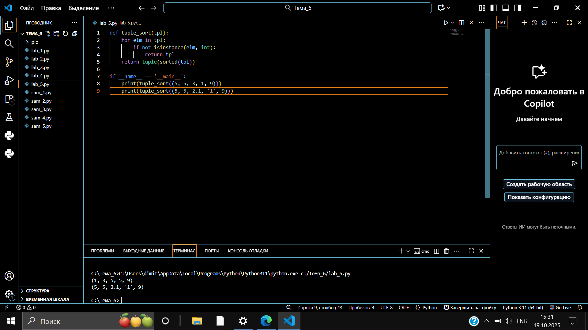
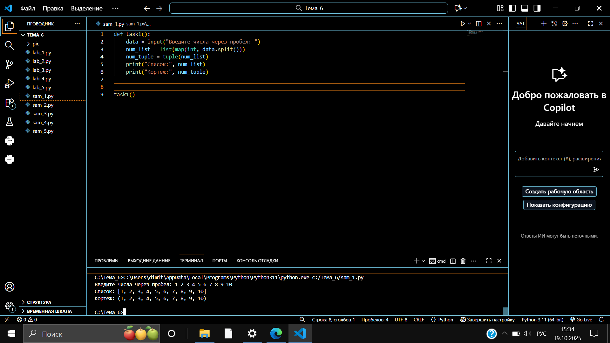
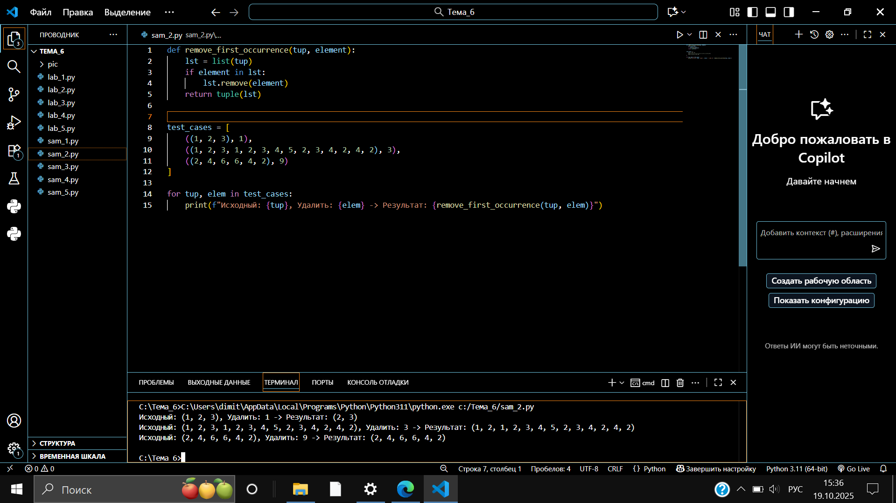
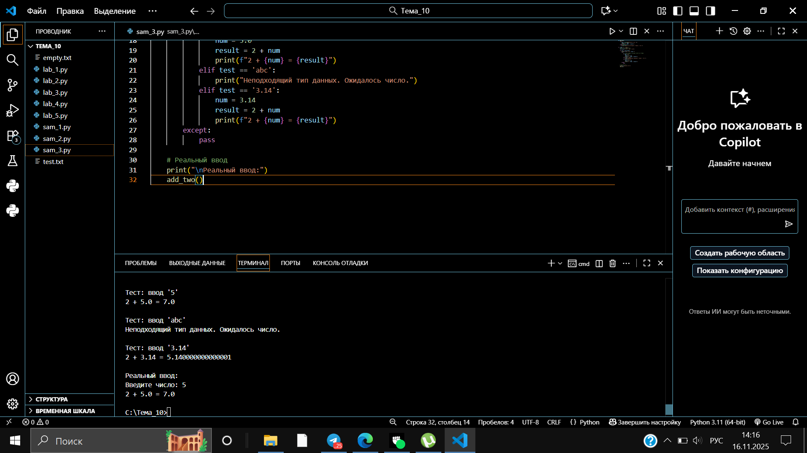
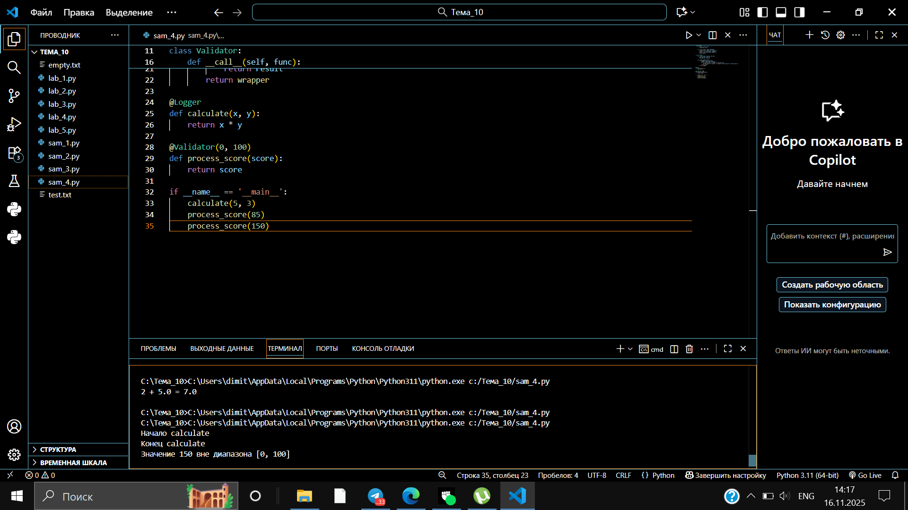
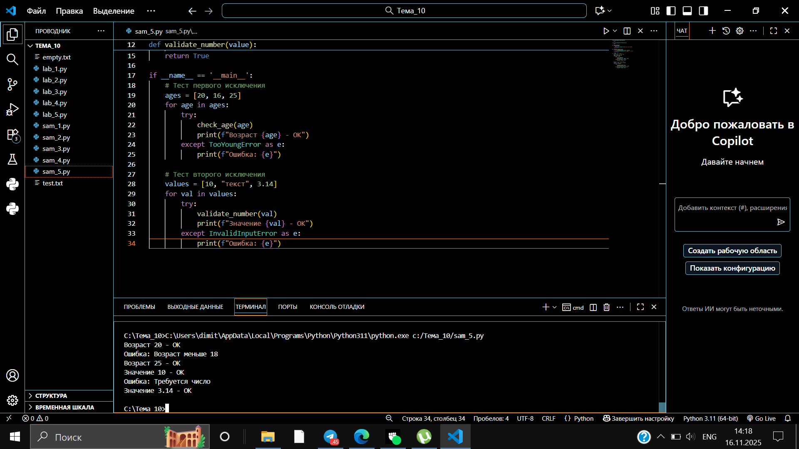

# Тема 6. Базовые коллекции: словари, кортежи.
Отчет по теме №6 выполнил:
- Беков Дмитрий Александрович
- АИС-23-1

| Задание | Лаб_раб | Сам_раб |
| ------ | ------ | ------ |
| Задание 1 | + | + |
| Задание 2 | + | + |
| Задание 3 | + | + |
| Задание 4 | + | + |
| Задание 5 | + | + |
| Задание 6 |  |  |
| Задание 7 |  |  |
| Задание 8 |  |  |
| Задание 9 |  |  |
| Задание 10 | |  |

## Лабораторная работа №1
### В школе, где вы учились, узнали, что вы крутой программист и попросили написать программу для учителей, которая будет при вводе кабинета писать для него ключ доступа и статус, занят кабинет или нет. При написании программы необходимо использовать словарь (dict), который на вход получает номер кабинета, а выводит необходимую информацию. Если кабинета, который вы ввели нет в словаре, то в консоль в виде значения ключа нужно вывести “None” и виде статуса вывести “False”.По большому счету написав данную программу мы с вами научились заменять иногда громоздкую конструкцию if/elif/else. Поскольку здесь функционал словаря полностью повторяет функционал условия, но при этом у использования словарей в более сложных программах есть намного больше возможностей реализации.
```python
request = int(input('Введите номер кабинета: '))
dictionary = {
    101: {'key': 1234, 'access': True},
    102: {'key': 1337, 'access': True},
    103: {'key': 8943, 'access': True},
    104: {'key': 5555, 'access': False},
    None: {'key': None, 'access': False},
}

response = dictionary.get(request)
if not response:
    response = dictionary[None]

key = response.get('key')
access = response.get('access')
print(key, access)
```
### Результат


## Лабораторная работа №2
### Алексей решил создать самый большой словарь в мире. Для этого он придумал функцию dict_maker(**kwargs), которая принимает неограниченное количество параметров «ключ: значение» и обновляет созданный им словарь my_dict, состоящий всего из одного элемента «first» со значением «so easy». Помогите Алексею создать данную функцию.
```python
from pprint import pprint

def dict_maker(**kwargs):
    my_dict.update(kwargs)

my_dict = {'first': 'so easy'}
dict_maker(second=2, third='three', fourth=[1, 2, 3])
pprint(my_dict, width=20, sort_dicts=False)
```
### Результат


## Лабораторная работа №3
### Для решения некоторых задач бывает необходимо разложить строку на отдельные символы. Мы знаем что это можно сделать при помощи split(), у которого более гибкая настройка для разделения для этого, но если нам нужно посимвольно разделить строку без всяких условий, то для этого мы можем использовать кортежи (tuple). Для этого напишем любую строку, которую будем делить и “обвернем” ее в tuple и дальше мы можем как нам угодно с ней работать, например, сделать ее списком (тогда получится полный аналог split()) или же работать с ним дальше, как с кортежем.
```python
s = "Пример строки"
tuple_s = tuple(s)
print(tuple_s)
list_s = list(tuple_s)
print(list_s)
```
### Результат


## Лабораторная работа №4
### Вовочка решил написать крутую функцию, которая будет писать имя, возраст и место работы, но при этом на вход этой функции будет поступать кортеж. Помогите Вовочке написать эту программу.
```python
def print_info(data):
    name, age, job = data
    print(f"Имя: {name}, Возраст: {age}, Место работы: {job}")

info = ("Вовочка", 25, "Школа")
print_info(info)
```
### Результат


## Лабораторная работа №5
### Для сопровождения первых лиц государства X нужен кортеж, но никто не может определиться с порядком машин, поэтому вам нужно написать функцию, которая будет сортировать кортеж, состоящий из целых чисел по возрастанию, и возвращает его. Если хотя бы один элемент не является целым числом, то функция возвращает исходный кортеж.
```python
def tuple_sort(tpl):
    for elm in tpl:
        if not isinstance(elm, int):
            return tpl
    return tuple(sorted(tpl))

if __name__ == '__main__':
    print(tuple_sort((5, 5, 3, 1, 9)))
    print(tuple_sort((5, 5, 2.1, '1', 9)))
```
### Результат


## Самостоятельная работа №1
### При создании сайта у вас возникла потребность обрабатывать данные пользователя в странной форме, а потом переводить их в нужные вам форматы. Вы хотите принимать от пользователя последовательность чисел, разделенных пробелом, а после переформатировать эти данные в список и кортеж. Реализуйте вашу задумку. Для получения начальных данных используйте input(). Результатом программы будет выведенный список и кортеж из начальных данных.

```python
def task1():
    data = input("Введите числа через пробел: ")
    num_list = list(map(int, data.split()))
    num_tuple = tuple(num_list)
    print("Список:", num_list)
    print("Кортеж:", num_tuple)


task1()
```
### Результат


### Выводы
- Используется input() для получения данных от пользователя

- split() разделяет строку по пробелам на список строк

- map(int, ...) преобразует каждую строку в число

- list() и tuple() создают соответствующие коллекции


## Самостоятельная работа №2
### Николай знает, что кортежи являются неизменяемыми, но он очень упрямый и всегда хочет доказать, что он прав. Студент решил создать функцию, которая будет удалять первое появление определенного элемента из кортежа по значению и возвращать кортеж без него. Попробуйте повторить шедевр не признающего авторитеты начинающего программиста. Но учтите, что Николай не всегда уверен в наличии элемента в кортеже (в этом случае кортеж вернется функцией в исходном виде).

```python
def remove_first_occurrence(tup, element):
    lst = list(tup)
    if element in lst:
        lst.remove(element)
    return tuple(lst)


test_cases = [
    ((1, 2, 3), 1),
    ((1, 2, 3, 1, 2, 3, 4, 5, 2, 3, 4, 2, 4, 2), 3),
    ((2, 4, 6, 6, 4, 2), 9)
]

for tup, elem in test_cases:
    print(f"Исходный: {tup}, Удалить: {elem} -> Результат: {remove_first_occurrence(tup, elem)}")
```
### Результат


### Выводы
- Кортеж преобразуется в список для возможности изменения

- remove() удаляет первое вхождение элемента

- Проверка element in lst обрабатывает случай отсутствия элемента

- Результат преобразуется обратно в кортеж

## Самостоятельная работа №3
### Ребята поспорили кто из них одним нажатием на pumpad наберет больше повторяющихся цифр, но не понимают, как узнать победителя. Вам им нужно в этом помочь. Дана строка в виде случайной последовательности чисел от 0 до 9 (длина строки минимум 15 символов). Требуется создать словарь, который в качестве ключей будет принимать данные числа (т. е. ключи будут типом int), а в качестве значений – количество этих чисел в имеющейся последовательности. Для построения словаря создайте функцию, принимающую строку из цифр. Функция должна возвратить словарь из 3-х самых часто встречаемых чисел, также эти значения нужно вывести в порядке возрастания ключа.

```python
from collections import Counter

def task3(digits_str):
    count = Counter(map(int, digits_str))
    top3 = count.most_common(3)
    sorted_top3 = sorted(top3, key=lambda x: x[0])
    result_dict = dict(top3)
    print("Три самых частых числа (ключ: количество):", result_dict)
    print("Значения в порядке возрастания ключа:", [val for _, val in sorted_top3])
    return result_dict

# Тестирование функции
test_string = "1234567890123456789012345"
print(f"Исходная строка: {test_string}")
task3(test_string)
```
### Результат


### Выводы
- Counter автоматически подсчитывает частоту элементов

- most_common(3) возвращает 3 самых частых элемента

- Сортировка по ключу выполняется с помощью sorted()

- Результат содержит словарь и значения в порядке возрастания ключа

## Самостоятельная работа №4
### Ваш хороший друг владеет офисом со входом по электронным картам, ему нужно чтобы вы написали программу, которая показывала в каком порядке сотрудники входили и выходили из офиса. Определение сотрудника происходит по id. Напишите функцию, которая на вход принимает кортеж и случайный элемент (id), его можно придумать самостоятельно. Требуется вернуть новый кортеж, начинающийся с первого появления элемента в нем и заканчивающийся вторым его появлением включительно. Если элемента нет вовсе – вернуть пустой кортеж. Если элемент встречается только один раз, то вернуть кортеж, который начинается с него и идет до конца исходного.

```python
def slice_between_occurrences(tup, element):
    if element not in tup:
        return ()
    first_index = tup.index(element)
    try:
        second_index = tup.index(element, first_index + 1) + 1
    except ValueError:
        return tup[first_index:]
    return tup[first_index:second_index]

test_cases = [
    ((1, 2, 3), 8),
    ((1, 8, 3, 4, 8, 8, 9, 2), 8),
    ((1, 2, 8, 5, 1, 2, 9), 8)
]

for tup, elem in test_cases:
    print(f"Кортеж: {tup}, ID: {elem} -> Результат: {slice_between_occurrences(tup, elem)}")
```
### Результат


### Выводы
- index() находит первое вхождение элемента

- Второй index() с параметром начала поиска находит следующее вхождение

- try-except обрабатывает случай, когда второго вхождения нет

- Срезы кортежа возвращают нужную часть последовательности

## Самостоятельная работа №5
### Разработайте программу для анализа успеваемости студентов. На вход программа получает список оценок студентов за тест (целые числа от 1 до 10). Программа должна:

- Определить и вывести кортеж уникальных оценок в отсортированном порядке

- Вычислить и вывести средний балл группы

- Найти и вывести количество студентов, получивших положительную оценку (7 и выше)

- Определить, есть ли в группе отличники (оценка 10)

```python
def analyze_grades(grades):
    
    unique_grades = tuple(sorted(set(grades)))
    
    average_grade = sum(grades) / len(grades)
    
    good_students = len([grade for grade in grades if grade >= 7])
    
    has_excellent = 10 in grades
    
    return unique_grades, average_grade, good_students, has_excellent


test_cases = [
    [5, 7, 8, 6, 9, 7, 10, 8, 6, 7],  
    [3, 4, 5, 6, 4, 5, 3, 6, 5, 4],   
    [8, 9, 10, 9, 10, 8, 9, 10, 9, 8] 
]

for i, grades in enumerate(test_cases, 1):
    print(f"Тест {i}:")
    print(f"Оценки: {grades}")
    
    unique, average, good_count, has_excellent = analyze_grades(grades)
    
    print(f"Уникальные оценки: {unique}")
    print(f"Средний балл: {average:.2f}")
    print(f"Студентов с оценкой 7+: {good_count}")
    print(f"Есть отличники: {'Да' if has_excellent else 'Нет'}")
    print("-" * 40)
```
### Результат


### Выводы
- set(grades) создает множество уникальных оценок

- sorted() и tuple() формируют отсортированный кортеж уникальных значений

- Средний балл вычисляется делением суммы на количество

- Генератор списка с условием подсчитывает студентов с хорошими оценками

- Проверка 10 in grades определяет наличие отличников

- Функция возвращает кортеж с четырьмя аналитическими показателями