# Тема 7. Работа с файлами (ввод, вывод)
Отчет по теме №7 выполнил:
- Беков Дмитрий Александрович
- АИС-23-1

| Задание | Лаб_раб | Сам_раб |
| ------ | ------ | ------ |
| Задание 1 | + | + |
| Задание 2 | + | + |
| Задание 3 | + | + |
| Задание 4 | + | + |
| Задание 5 | + | + |
| Задание 6 | + |  |
| Задание 7 | + |  |
| Задание 8 | + |  |
| Задание 9 | + |  |
| Задание 10 |+ |  |

## Лабораторная работа №1
### Составьте текстовый файл и положите его в одну директорию с программой на Python. Текстовый файл должен состоять минимум из двух строк.
### Результат
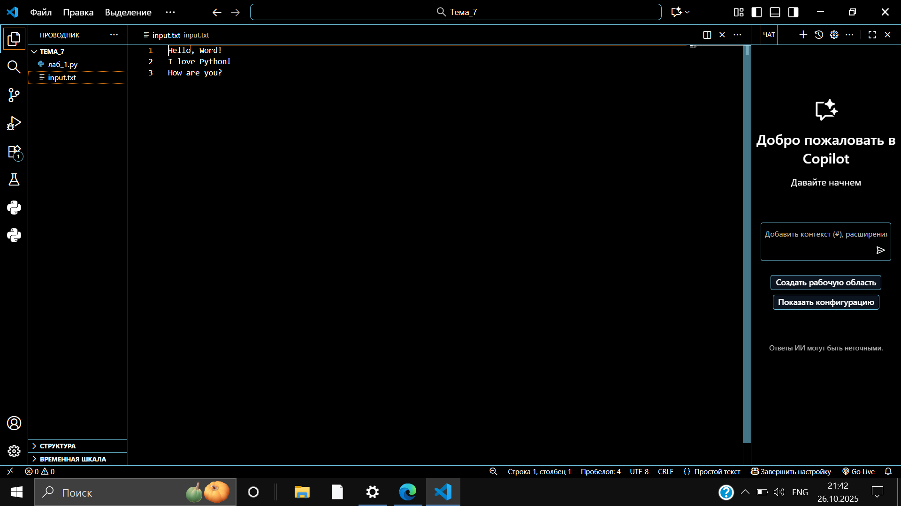

## Лабораторная работа №2
###  Напишите программу, которая выведет только первую строку из вашего файла, при этом используйте конструкцию open()/close().
```python
file = open('input.txt', 'r', encoding='utf-8')
first_line = file.readline()
print(first_line)
file.close()
```
### Результат
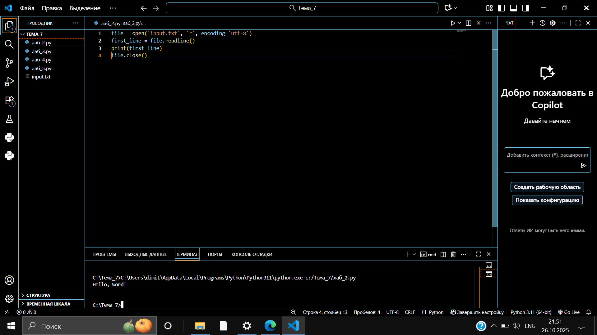

## Лабораторная работа №3
### Напишите программу, которая выведет все строки из вашего файла в массиве, при этом используйте конструкцию open()/close().
```python
file = open('input.txt', 'r', encoding='utf-8')
print(file.readlines())
file.close()
```
### Результат
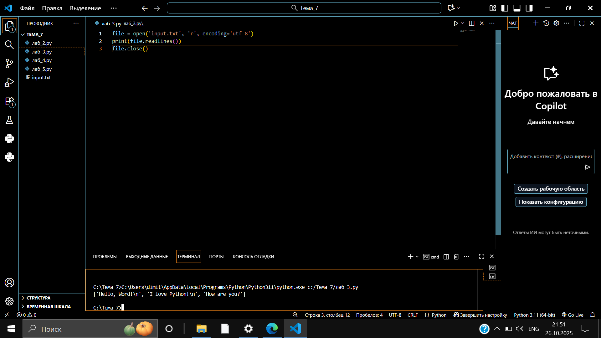

## Лабораторная работа №4
### Напишите программу, которая выведет все строки из вашего файла в массиве, при этом используйте конструкцию with open().
```python
with open('input.txt') as f:
    print(f.readlines())
```
### Результат
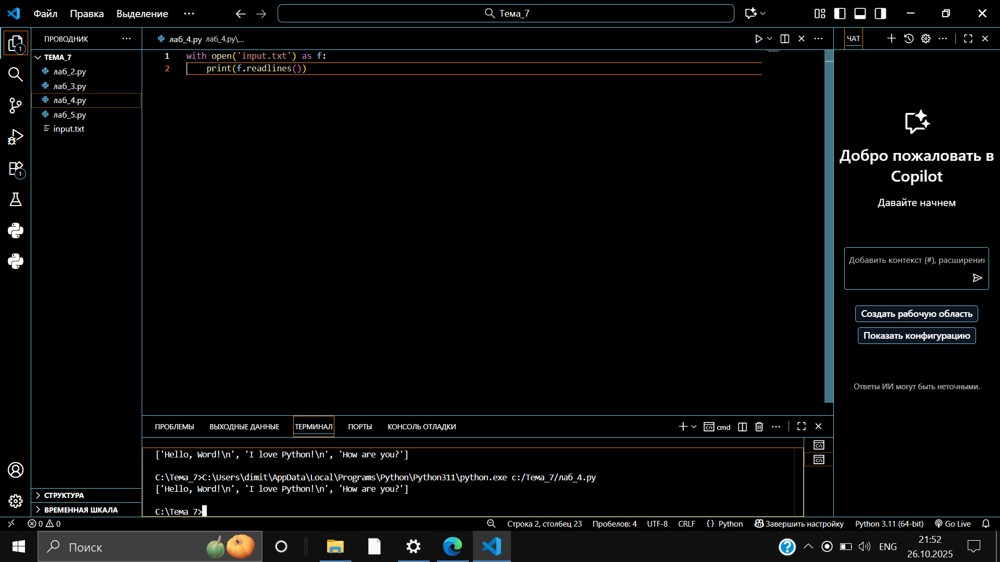

## Лабораторная работа №5
### Напишите программу, которая выведет каждую строку из вашего файла отдельно, при этом используйте конструкцию with open().
```python
with open('input.txt') as f:
    for line in f:
        print(line)
```
### Результат
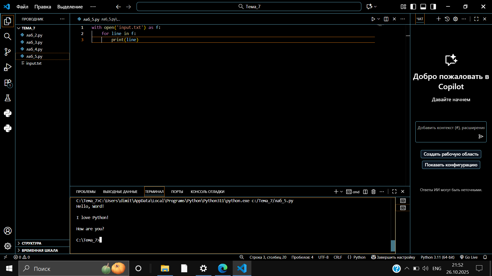

## Лабораторная работа №6
### Напишите программу, которая будет добавлять новую строку в ваш файл, а потом выведет полученный файл в консоль. Вывод можно осуществлять любым способом. Обязательно проверьте сам файл, чтобы изменения в нем тоже отображались.
```python
with open('input.txt', 'a+') as f:
    f.write('\nIm additional line')
    
with open('input.txt', 'r') as f:
    result = f.readlines()
    print(result)
    
```
### Результат
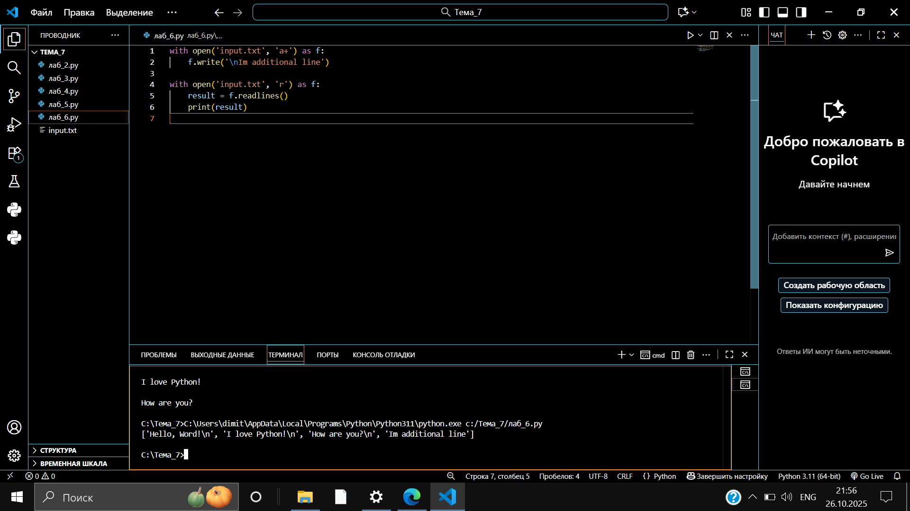

## Лабораторная работа №7
### Напишите программу, которая перепишет всю информацию, которая была у вас в файле до этого, например напишет любые данные из произвольно вами составленного списка. Также не забудьте проверить что изменения сохранилась в файле.
```python
lines = ['one', 'two', 'three']
with open('input.txt', 'w') as f:
    for line in lines:
        f.write('\nCycle run ' + line)
print('Done!')
```
### Результат


## Лабораторная работа №8
### Выберите любую папку на своем компьютере, имеющую вложенные директории. Выведите на печать в терминал ее содержимое, как и всех подкаталогов при помощи функции print_docs(directory).
```python
import os

def print_docs(directory):
    all_files = os.walk(directory)
    for catalog in all_files:
        print(f'Папка {catalog[0]} содержит:')
        print(f'Директории: {", ".join([folder for folder in catalog[1]])}')
        print(f'Файлы: {", ".join([file for file in catalog[2]])}')
        print('.' * 40)

print_docs('/Program Files/HP')
```
### Результат
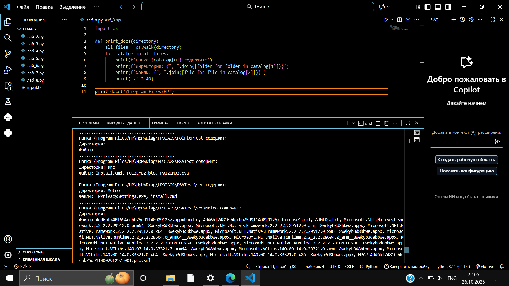

## Лабораторная работа №9
### Документ «input.txt» содержит следующий текст: Приветствие, Спасибо, Извините, Пожалуйста, До свидания, Ты готов?, Как дела?, С днем рождения!, Удача!, Я тебя люблю. Требуется реализовать функцию, которая выводит слово, имеющее максимальную длину (или список слов, если таковых несколько). Проверьте работоспособность программы на своем наборе данных.
```python
def find_longest_words(filename):
    with open(filename, 'r', encoding='utf-8') as file:
        words = [line.strip() for line in file if line.strip()]
    
    if not words:
        return []
    
    max_length = max(len(word) for word in words)
    longest_words = [word for word in words if len(word) == max_length]
    
    return longest_words

result = find_longest_words('input.txt')
print("Слова с максимальной длиной:", result)
```
### Результат
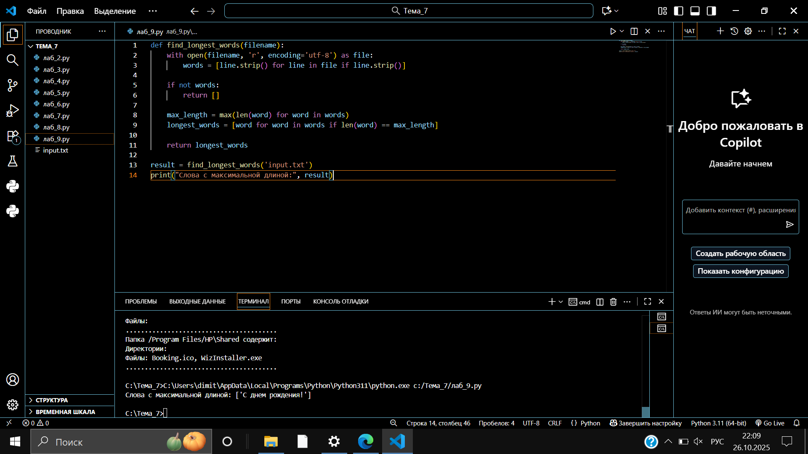

## Лабораторная работа №10
### Требуется создать csv-файл «rows_300.csv» со следующими столбцами: № - номер по порядку (от 1 до 300); Секунда – текущая секунда на вашем ПК; Микросекунда – текущая миллисекунда на часах. Для наглядности на каждой итерации цикла искусственно приостанавливайте скрипт на 0,01 секунды.
```python
import csv
import datetime
import time

with open('rows_300.csv', 'w', encoding='utf-8', newline='') as f:
    writer = csv.writer(f)
    writer.writerow(['№', 'Секунда', 'Микросекунда'])
    for line in range(1, 301):
        writer.writerow([line, datetime.datetime.now().second,
                        datetime.datetime.now().microsecond])
        time.sleep(0.01)
```
### Результат
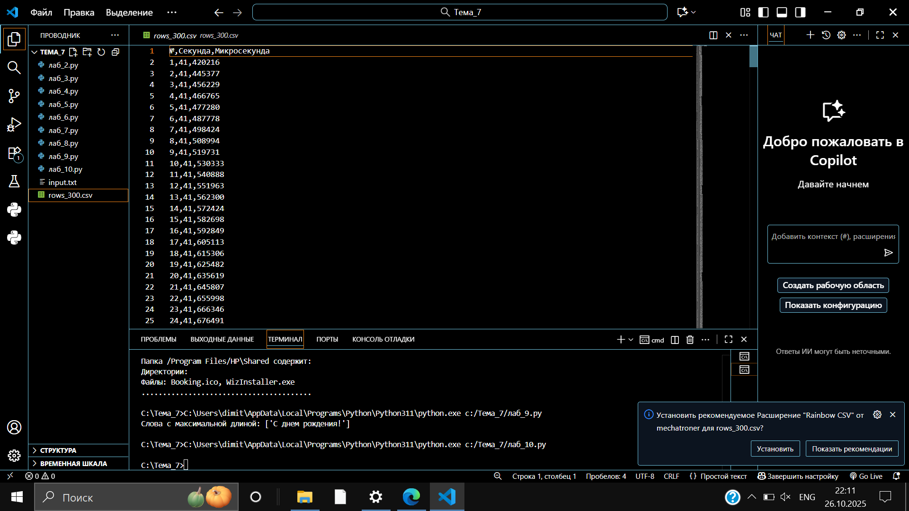

## Самостоятельная работа №1
###  Найдите в интернете любую статью (объем статьи не менее 200 слов), скопируйте ее содержимое в файл и напишите программу, которая считает количество слов в текстовом файле и определит самое часто встречающееся слово. Результатом выполнения задачи будет: скриншот файла со статьей, листинг кода, и вывод в консоль, в котором будет указана вся необходимая информация.

```python
from collections import Counter
import re

def analyze_text(filename):
    with open(filename, 'r', encoding='utf-8') as file:
        text = file.read()
    
    # Разделение текста на слова (игнорируя знаки препинания)
    words = re.findall(r'\b\w+\b', text.lower())
    
    # Подсчет общего количества слов
    total_words = len(words)
    
    # Поиск самого частого слова
    word_counts = Counter(words)
    most_common_word, count = word_counts.most_common(1)[0]
    
    print(f"Общее количество слов: {total_words}")
    print(f"Самое частое слово: '{most_common_word}' (встречается {count} раз)")
    print(f"Топ-5 самых частых слов: {word_counts.most_common(5)}")

# Использование
analyze_text('статья.txt')
```
### Результат
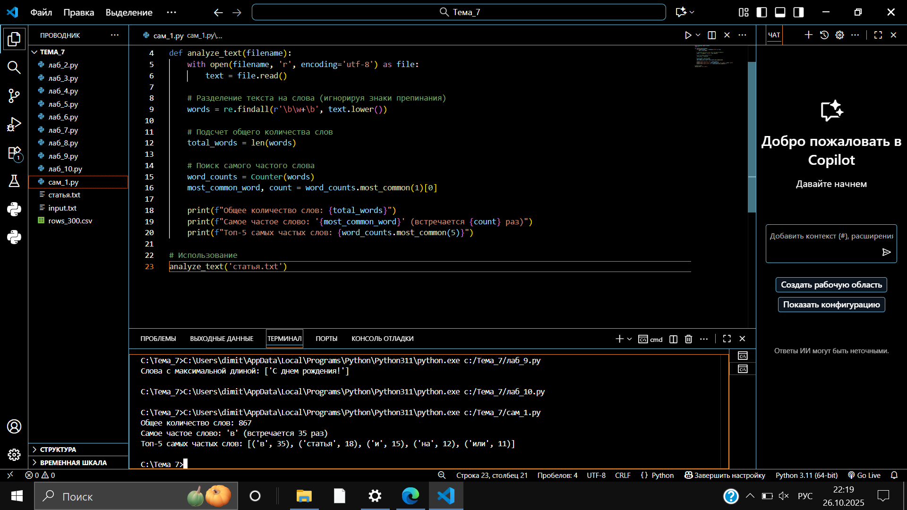
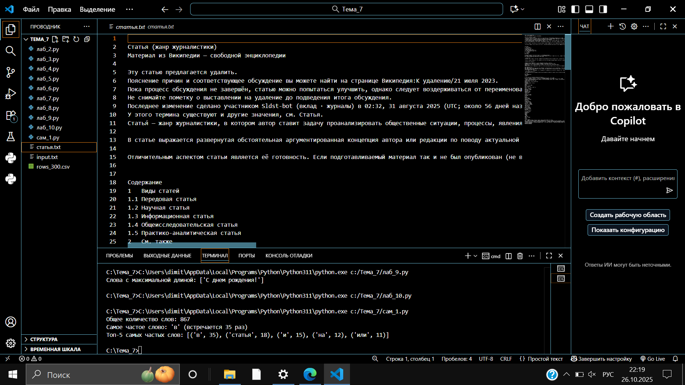

### Выводы

## Самостоятельная работа №2
### У вас появилась потребность в ведении книги расходов, посмотрев все существующие варианты вы пришли к выводу что вас ничего не устраивает и нужно все делать самому. Напишите программу для учета расходов. Программа должна позволять вводить информацию о расходах, сохранять ее в файл и выводить существующие данные в консоль. Ввод информации происходит через консоль. Результатом выполнения задачи будет: скриншот файла с учетом расходов, листинг кода, и вывод в консоль, с демонстрацией работоспособности программы.

```python
import datetime

def add_expense():
    category = input("Введите категорию расхода: ")
    amount = float(input("Введите сумму расхода: "))
    description = input("Введите описание расхода: ")
    
    with open('expenses.txt', 'a', encoding='utf-8') as file:
        timestamp = datetime.datetime.now().strftime("%Y-%m-%d %H:%M:%S")
        file.write(f"{timestamp} | {category} | {amount} | {description}\n")
    
    print("Расход успешно добавлен!")

def show_expenses():
    try:
        with open('expenses.txt', 'r', encoding='utf-8') as file:
            expenses = file.readlines()
        
        if not expenses:
            print("Расходы не найдены.")
            return
        
        print("\n--- ВАШИ РАСХОДЫ ---")
        total = 0
        for expense in expenses:
            print(expense.strip())
            parts = expense.split(' | ')
            total += float(parts[2])
        print(f"\nОбщая сумма расходов: {total}")
    
    except FileNotFoundError:
        print("Файл с расходами не найден.")

def main():
    while True:
        print("\n1. Добавить расход")
        print("2. Показать расходы")
        print("3. Выход")
        
        choice = input("Выберите действие: ")
        
        if choice == '1':
            add_expense()
        elif choice == '2':
            show_expenses()
        elif choice == '3':
            break
        else:
            print("Неверный выбор")

if __name__ == "__main__":
    main()
```
### Результат
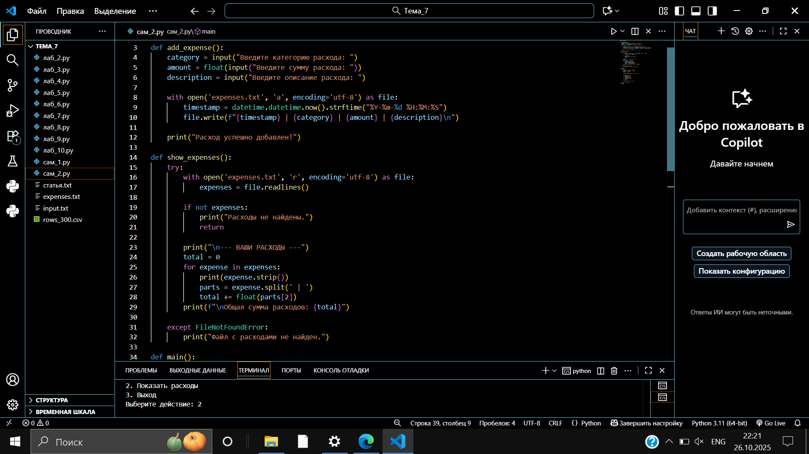
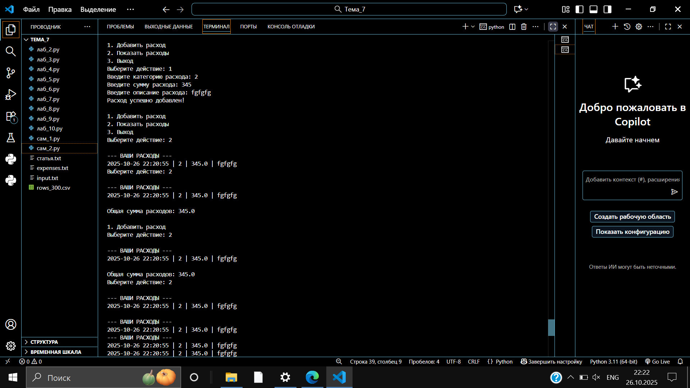
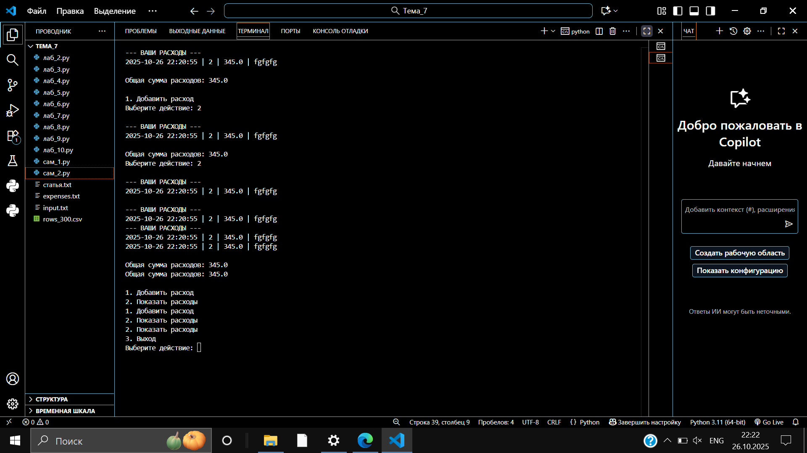
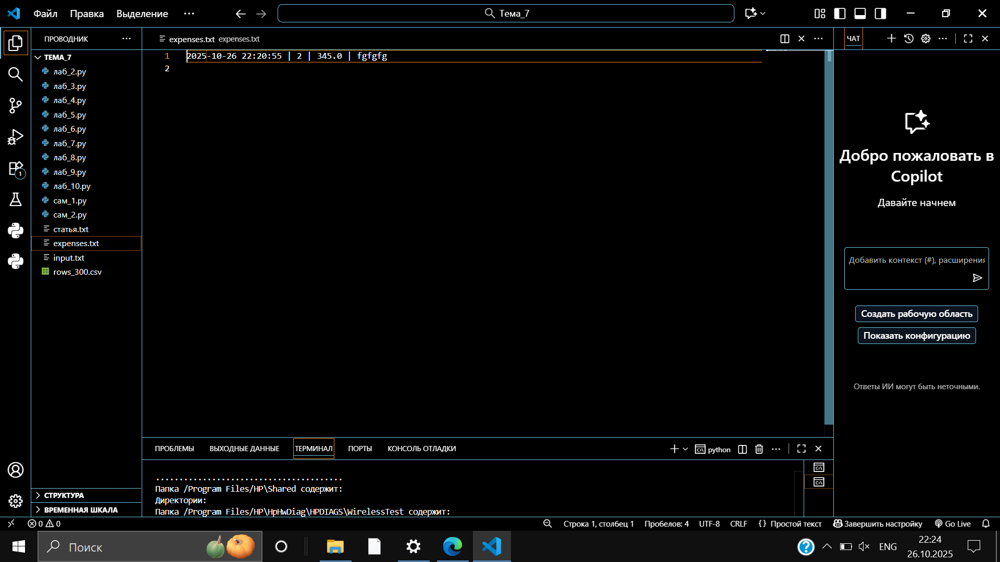

### Выводы

## Самостоятельная работа №3
###  Имеется файл input.txt с текстом на латинице. Напишите программу, которая выводит следующую статистику по тексту: количество букв латинского алфавита; число слов; число строк.

### Текст в файле:

### Beautiful is better than ugly.
### Explicit is better than implicit.
### Simple is better than complex.
### Complex is better than complicated.

### Ожидаемый результат:

### Input file contains:
### 108 letters
### 20 words
### 4 lines

```python
def text_statistics(filename):
    with open(filename, 'r', encoding='utf-8') as file:
        lines = file.readlines()
    
    letter_count = 0
    word_count = 0
    line_count = len(lines)
    
    for line in lines:
        # Подсчет букв латинского алфавита
        for char in line:
            if char.isalpha() and char.isascii():
                letter_count += 1
        
        # Подсчет слов
        words = line.split()
        word_count += len(words)
    
    print(f"Input file contains:")
    print(f"{letter_count} letters")
    print(f"{word_count} words")
    print(f"{line_count} lines")

# Использование
text_statistics('input.txt')
```
### Результат
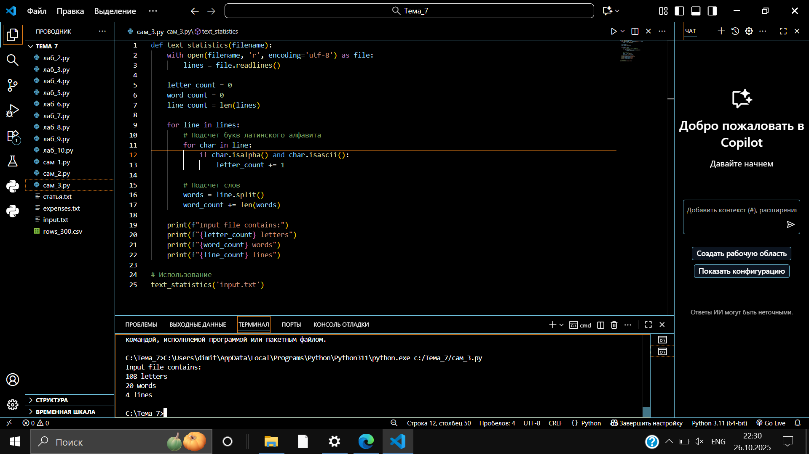

### Выводы

## Самостоятельная работа №4
### Напишите программу, которая получает на вход предложение, выводит его в терминал, заменяя все запрещенные слова звездочками * (количество звездочек равно количеству букв в слове). Запрещенные слова, разделенные символом пробела, хранятся в текстовом файле input.txt. Все слова в этом файле записаны в нижнем регистре. Программа должна заменить запрещенные слова, где бы они ни встречались, даже в середине другого слова. Замена производится независимо от регистра: если файл input.txt содержит запрещенное слово exam, то слова exam, Exam, ExaM, EXAM и exAm должны быть заменены на ****.

```python
import re

def load_banned_words(filename):
    with open(filename, 'r', encoding='utf-8') as file:
        content = file.read()
        return content.lower().split()

def censor_text(text, banned_words):
    # Создаем регулярное выражение для каждого запрещенного слова
    for word in banned_words:
        # Ищем слово в любом регистре, даже как часть другого слова
        pattern = re.compile(re.escape(word), re.IGNORECASE)
        # Заменяем на звездочки той же длины
        replacement = '*' * len(word)
        text = pattern.sub(replacement, text)
    
    return text

def main():
    # Загружаем запрещенные слова
    banned_words = load_banned_words('input.txt')
    
    # Получаем текст от пользователя
    text = input("Введите предложение для проверки: ")
    
    # Цензурируем текст
    censored_text = censor_text(text, banned_words)
    
    print("Результат:")
    print(censored_text)

if __name__ == "__main__":
    main()
```
### Результат
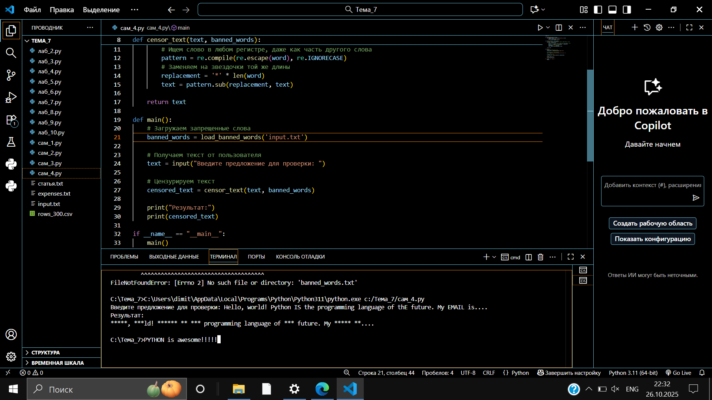

### Выводы

## Самостоятельная работа №5
### Разработайте программу для учета оценок студентов. Программа должна обеспечивать следующие функции: добавление новой оценки (имя студента, предмет, оценка), просмотр всех оценок, расчет среднего балла по всем оценкам. Все данные должны сохраняться в текстовый файл. Ввод информации происходит через консоль. Результатом выполнения задачи будет: скриншот файла с оценками, листинг кода, и вывод в консоль, с демонстрацией работоспособности программы.

```python
def student_grades_manager():
    """
    Программа для учета оценок студентов.
    Позволяет добавлять, просматривать и вычислять средний балл.
    """
    def add_grade():
        name = input("Введите имя студента: ")
        subject = input("Введите предмет: ")
        grade = input("Введите оценку: ")
        
        with open('grades.txt', 'a', encoding='utf-8') as file:
            file.write(f"{name} | {subject} | {grade}\n")
        
        print("Оценка добавлена!")
    
    def view_grades():
        try:
            with open('grades.txt', 'r', encoding='utf-8') as file:
                grades = file.readlines()
            
            if not grades:
                print("Оценки не найдены.")
                return
            
            print("\n--- ОЦЕНКИ СТУДЕНТОВ ---")
            for grade in grades:
                print(grade.strip())
        
        except FileNotFoundError:
            print("Файл с оценками не найден.")
    
    def calculate_average():
        try:
            with open('grades.txt', 'r', encoding='utf-8') as file:
                grades = file.readlines()
            
            if not grades:
                print("Оценки не найдены.")
                return
            
            total = 0
            count = 0
            
            for grade_line in grades:
                parts = grade_line.strip().split(' | ')
                if len(parts) >= 3:
                    try:
                        total += int(parts[2])
                        count += 1
                    except ValueError:
                        continue
            
            if count > 0:
                average = total / count
                print(f"Средний балл: {average:.2f}")
            else:
                print("Нет действительных оценок.")
        
        except FileNotFoundError:
            print("Файл с оценками не найден.")
    
    while True:
        print("\n--- УЧЕТ ОЦЕНОК СТУДЕНТОВ ---")
        print("1. Добавить оценку")
        print("2. Просмотреть оценки")
        print("3. Средний балл")
        print("4. Выход")
        
        choice = input("Выберите действие: ")
        
        if choice == '1':
            add_grade()
        elif choice == '2':
            view_grades()
        elif choice == '3':
            calculate_average()
        elif choice == '4':
            break
        else:
            print("Неверный выбор")

# Запуск программы
student_grades_manager()
```
### Результат
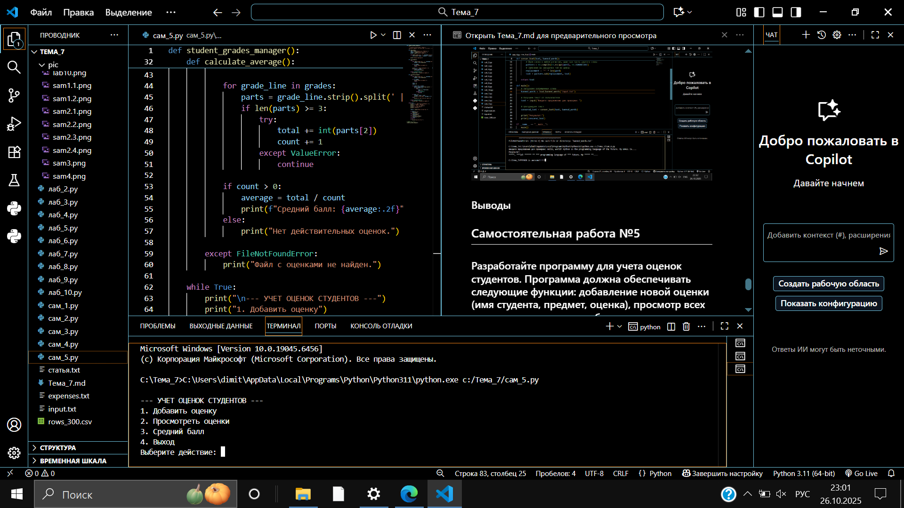

### Выводы

